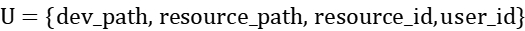

 

 

# School teacher and student learning resources online management system

# 1 Overview

## 1.1 Project Overview

Due to the impact of the COVID-19 pandemic and the development of online teaching, online learning has gradually eliminated the traditional written teaching method. In the network environment, online learning has diversified the ways of learning knowledge, software equipment and its content. While bringing convenience, it also brings the drawbacks of resource management:

In order to meet the needs of different teachers, students need to download and manage various learning applications for learning. It is difficult to achieve unified management of their own records and learning resources that need to be operated on the software. For example, a student has multiple learning devices, and some resources are located on separate devices and cannot be managed in a unified manner. Different forms such as doc resources, video resources, ppt resources also make it difficult to manage unified. Moreover, due to too many, the resource file directory is complicated. Sometimes it is difficult for us to remember which final version of the file we submitted after changing it.

Existing management platforms such as canvas can be very good for teachers who submit students' assignments to log on the canvas website in time. It is possible to check students' files. According to the reactions of many colleagues, there are often mailbox submission failures, canvas submission failure due to network transmission reasons or file selection errors, resulting in the teacher not seeing the latest version of the file, or sometimes due to network reasons, the file was not submitted successfully, resulting in major mistakes in the end.

In order to solve this problem, this paper hopes to propose a cross-learning software, cross-device, local resources to cloud resources real-time synchronization of learning resource management tool. To achieve a real-time update of local resources to the cloud, for different devices and operating systems, as long as you specify an online sync folder. The content of the folder can be synchronized to the cloud in time. And the teacher can view and modify it, this phenomenon can be avoided.

Based on Cloud as a Service With the development of technology, Baidu network disk, NetEase Cloud Gaming, etc., software that can unify multiple devices and tools for inductive management continues to emerge. This paper draws on the above technology, because the cloud system has the advantages of not occupying the host Memory Space and processes. All operations do not need to be submitted locally. Modify locally, and the modified content can be synchronized to the cloud in time and reviewed by the teacher.

# 2 Requirements Analysis

## 2.1 Functional Requirements

### 2.1.1 Main function description

1. resource content mapping - according to the user equipment learning resources Path address in the Cloud as a Service to build a relationship image, learning resources selection, submitted by the user itself needs to manage learning resources synchronization to the server.

2. Database management - Construct a resource management database for each user's learning resource information, sub-device, and sub-category in the cloud. The purpose of online resource unified management is to be able to manage multiple search codes such as subjects, equipment categories, resource categories, and resource names. Corresponding to the retrieved through the database Cloud as a Service physical storage location, access the file content stored in the server.

3. update synchronization - according to user request update, add, query resources, the new resource will be in the Cloud as a Service server server side to set up a new content mapping, while building a new item in the database side correspondence table, delete the resource will delete the above two.

4. Interactive function - The system can be used to log in on any device. After logging in, it has the ability to manage, query, and access the resource information corresponding to each device, software, and category of the user. Due to the large amount of information transmission and display content of the access information, consider opening the image file on the browsing server online through a web page. There is no modification function added during the access process. The modification function needs to be updated and synchronized locally after the modification is completed. The adjustment of specific functions will be improved in the system implementation link. The basic flow is as follows.

### 2.1.2 System function flow

 

## 2.2 Data dictionary

1. User information User table

| Field Meaning | Field Name | Type | Constraint |
| -------- | -------- | ----------- | ----------- |
| 用户名   | user_id  | varchar(30) | primary key |
| password | varchar (30) | not null |
| nickname | varchar (30) | |

 

2. User equipment information table Device

| Field Meaning | Field Name | Type | Constraint |
| -------------- | --------------- | ------------ | ------------------------ |
| 用户名         | user_id         | varchar(30)  | not null                 |
| device number | dev_id | varchar (30) | not null |
| device name | dev_name | varchar (30) | not null |
| 设备路径       | dev_path        | varchar(256) | primary key\|foreign key |
| Total resources | resource_number | varchar (256) | not null |
| Total number of resource spaces | resource_space | integer | |
| Maximum device space | dev_space | integer | |

 

3. DeviceResource information table DeviceResource

| Field Meaning | Field Name | Type | Constraint |
| -------- | ------------- | ------------ | ------------------------ |
| 资源路径 | resource_path | varchar(256) | primary key\|foreign key |
| Device Path | device_path   | varchar(256) | primary key\|foreign key |
| resource name | resource_id | varchar (30) | not null |

 

4. Resource basic information table Resource

| Field Meaning | Field Name | Type | Constraint |
| -------- | -------------- | ------------ | ------------------------ |
| Resource Path | dev_path       | varchar(256) | primary key\|foreign key |
| Device Path | resource_path  | varchar(256) | primary key\|foreign key |
| Resource Type | resource_type  | varchar(30)  | not null\|foreign key    |
| Resource size | resource_space | integer | |
| resource name | resource_id | varchar (30) | not null |

 

5. Subject resource information table ClassResource

| Field Meaning | Field Name | Type | Constraint |
| -------- | ------------- | ------------ | ------------------------ |
| Device Path | dev_path      | varchar(256) | primary key\|foreign key |
| Resource Path | resource_path | varchar(256) | primary key\|foreign key |
| user name | user_id       | varchar(30)  | foreign key\|not null    |
| Subject Name | class_id | varchar (30) | not null |
| resource name | resource_id | varchar (30) | not null |

 

6. Doc resource information table DocResource

| Field Meaning | Field Name | Type | Constraint |
| -------- | ------------- | ------------ | ------------------------ |
| User name | user_id       | varchar(256) | foreign key              |
| resource path | resource_path | varchar(256) | primary key\|foreign key |
| resource name | resource_id | varchar (30) | not null |
| device path | dev_path      | varchar(256) | primary key\|foreign key |

 

7. Audio/Video Resource Information Table MediaResource

| Field Meaning | Field Name | Type | Constraint |
| -------- | ------------- | ------------ | ------------------------ |
| User name | user_id       | varchar(256) | foreign key              |
| resource path | resource_path | varchar(256) | primary key\|foreign key |
| resource name | resource_id | varchar (30) | not null |
| device path | dev_path      | varchar(256) | primary key\|foreign key |

 

8. Recently used files RecentResource

| Field Meaning | Field Name | Type | Constraint |
| ---------------- | --------------- | ------------ | ------------------------ |
| User name  | user_id         | varchar(256) | foreign key              |
| resource name | resource_id | varchar (30) | not null |
| device path | dev_path        | varchar(256) | primary key\|foreign key |
| resource name | resource_path   | varchar(256) | primary key\|foreign key |
| Resource last used | recent_use_time | Timestamp | not null |

 

9. FrequentUseResource

| Field Meaning | Field Name | Type | Constraint |
| -------------- | ------------- | ------------ | ------------------------ |
| User name | user_id       | varchar(256) | foreign key              |
| resource name | resource_id | varchar (30) | not null |
| device path | dev_path      | varchar(256) | primary key\|foreign key |
| resource name | resource_path | varchar(256) | primary key\|foreign key |
| Frequency of use in the past week | frequency | double | not null |

 

10. Cloud Space Management Table CloudManagement

| Field Meaning | Field Name | Type | Constraint |
| -------- | ----------- | ------------ | ----------- |
| Space ID | cloud_id | varchar (30) | primary key |
| Number of devices | dev_path | varchar (256) | not null |
| Number of users | user_number | integer | not null |
| User name | user_id     | varchar(256) | foreign key |

 

# 3 Feasibility Analysis

## 3.1 Technical feasibility

With the advent of the 5G era and the development of Cloud as a Service technology, the network transmission speed continues to increase, and computing power resources continue to be submitted from the local to the remote. Existing file management systems such as WPS have integrated WPS cloud doc and other technologies, that is, memory-and-transfer, to prevent data loss due to local devices. The current cloud transmission speed and transmission technology are sufficient to meet the implementation functions of the system.

## 3.2 Application feasibility

It is difficult for existing file management systems to synchronize files across devices and software applications. Take WPS as an example, WPS can easily manage doc files on mobile phones and computers, including basic work resources such as word, pdf, ppt, excel, etc., which can effectively store and manage such resources. However, the function of wps is only limited to work file resources, and it is difficult to manage other types of files in a unified manner. At the same time, wps cannot classify and manage learning content (such as study subjects, file categories, etc.), and often only lists all recently opened files after opening, making it difficult to achieve the purpose of intelligent management.

## 3.3 Economic feasibility

In the case of ignoring the cost of database construction, the management cost of the system and Cloud as a Service server maintenance costs + network transmission costs close enough to ensure economic viability.

# 4 Concept Design

## 4.1 Overview

For the entire concept design, focus on the following tasks:

1, the data dictionary obtained according to experience in the demand analysis is split and integrated into the relationship between entities, and it is required to ensure that the attributes in the relationship do not appear as much as possible, and the attributes in the entity minimize redundancy.

2. When changing the data dictionary to an entity table, pay attention to re-modifying the naming of the entity table and attributes to conform to the normalized expression of the database.

3. Analyze the method of expressing entities and the relationship between entities, take the data dictionary as a reference, and add or delete fields if necessary to optimize the design.

## 4.2 Property description

### 4.2.1 User Information Table

Description

The user information table is used to load user information that has been registered and constructed resource mapping, and is used for retrieval, addition, and deletion. User information is uniquely identified by a non-repeatable username id.

Description

| Properties | Field Name | Description |
| ------ | -------- | ------------------ |
| Username | id | Identify the account's unique identity |
| Password | password | Password used by the user to log in |
| Nickname | nickname | User-defined name |

 

 

### 4.2.2 User Equipment Table Device

Description

It is used to record which devices the user is currently using to store data, the current usage of the user's device, quota, and the Cloud Drive resource disk number where the corresponding device is located. Each user has multiple devices (such as PC, ipad, etc.)

Description

| Field Meaning | Field Name | Description |
| ------------ | --------------- | -------------------------------------- |
| Username | id | Identify the account's unique identity |
| Device Number | dev_id | Determine the number of the device corresponding to this account |
| Device Name | dev_name | Each device has a device name for user differentiation |
| Device Path | dev_path | Determine Cloud as a Service Unique representation of device mapped address |
| Existing resources | occupied_space | The total amount of space occupied by the resources owned by the device |
| Device space capacity | dev_space | Maximum physical space for the device |
| Total resources | resource_number | Total number of resources owned by the device |
| Cloud Drive number | cloud_id | Cloud Drive number where the current device map is located (default is 1) |

 

### 4.2.3 DeviceResource Information DeviceResource Table

Description

It is used to record the resource information owned by each device, including resource name and Path information; because it is in the same order as the local physical storage record, it is used for the construction of the main index.

description

| Field Meaning | Field Name | Description |
| -------- | ------------- | -------------------------------------- |
| Resource Path | resource_path | Facility Management's unique identifier of the resource file, primary key |
| Resource name | resource_id | Resource file name |
| Device Path | dev_path | Determine Cloud as a Service Unique representation of device mapped address |

 

### 4.2.4 Basic Resource Information Table Resource

Description

Resource table for recording the detailed information of each resource file, the device label and the resource Path as a unique location of the resource flag, additional recording resource type, size, name and other basic information of the file.

description

| Field Meaning | Field Name | Description |
| -------- | -------------- | ---------------------------------- |
| Device Path | dev_path | Cloud as a Service Unique representation of device mapped address |
| Resource Path | resource_path | Resource Path for each device |
| Resource id | resource_id | Resource file name |
| Resource type | resource_type | Resource file format, doc, audio/video |
| Resource size | resource_space | The size of the resource space is automatically determined when uploading |
| Resource name | resource_id | Resource file name, determined automatically when uploading |

 

### 4.2.5 Subject Resource Information Table ClassResource

Description

The account resource information table is used for "sub-account", storing custom account storage, to achieve the purpose of accessing all resource information according to the account index. Filter out the basic information, and add class_id fields for storing record information of sub-account.

description

| Field Meaning | Field Name | Description |
| -------- | ------------- | ---------------------------------- |
| User ID | user_id | Uniquely identify the user's number |
| Subject name | class_id | User-defined subject name |
| Device Path | dev_path | Cloud as a Service Unique representation of device mapped address |
| Resource Path | resource_path | Unique identifier of the resource managed by this user device |
| Resource name | resource_id | Corresponding subject resource file name |

 

 

### 4.2.6 doc resource information table DocResource

Description

The doc resource information table is used to record resource information classified as "doc class" under user-owned devices and directories for classification search and indexing.

description

| Field Meaning | Field Name | Description |
| -------- | ------------- | ---------------------------------- |
| User ID | user_id | Uniquely identify the user's number |
| Resource Path | resource_path | Unique identifier of the resource managed by this user device |
| Device Path | dev_path | Cloud as a Service Unique representation of device mapped address |
| Resource name | resource_id | doc class resource file name |

 

 

### 4.2.7 Audio/Video Resource Information Table MediaResource

Description

The audio/video resource information table is used to record the resource information classified as "audio/video" under all user devices, which is convenient for classification and indexing.

The content of the attribute description is similar to that of the 4.2.6 doc resource information table DocResource, and will not be repeated here.

### 4.2.8 Recently used files RecentResource

Description

The recently used document information table is used to record the documents recently used by the user, which is convenient for the user to use the online resource learning management system to better find the recently used documents as an extension of the learning resource management system.

description

| Field Meaning | Field Name | Description |
| ---------------- | --------------- | ---------------------------------- |
| User ID | user_id | Uniquely identify the user's number |
| Resource id | resource_id | Number that uniquely identifies the resource file |
| Resource Path | resource_path | Unique identifier of the resource managed by this user device |
| Device Path | dev_path | Cloud as a Service Unique representation of device mapped address |
| Last time a resource was used | recent_use_time | Last time a resource was used |

 

### 4.2.9 FrequentUseResource

Description

Recently used file information table for recording the most frequently used file resources in the last week, users better locate the most frequently used resources in the near future to facilitate the continued use of users, improve positioning efficiency, as an extension of the learning resource management system.

description

| Field Meaning | Field Name | Description |
| -------------- | ------------- | ---------------------------------- |
| User ID | user_id | Uniquely identify the user's number |
| Resource Path | resource_path | Unique identifier of the resource managed by this user device |
| Device Path | dev_path | Cloud as a Service Unique representation of device mapped address |
| Frequency of use in the past week | frequency | Total space occupied by audio/video resources |
| Resource id | resource_id | Number that uniquely identifies the resource file |

 

 

### 4.2.10 Cloud Space Management Table CloudManagement

Description

Since there may be more than one Cloud Drive used to store users, this table records all devices, user numbers, numbers, and statistics on the total occupied space capacity and maximum space capacity information for all Cloud Drive resource management.

description

| Field Meaning | Field Name | Description |
| -------------- | -------------------- | ------------------------------------- |
| Cloud Drive number | cloud_id | Default is 1, if the capacity exceeds the limit, you need to increase Cloud Drive |
| User ID | user_id | Uniquely identify the user's number |
| Number of occupied spaces | cloud_occupied_space | Number of occupied spaces |
| Maximum space capacity | cloud_max_space | Maximum space capacity in the cloud |

 

## 4.3 Relationship description

In the relationship description, starting from the relationship of static data, the complexity of the relationship is analyzed, and then a relationship description of "entity-relationship-entity-relationship-entity" is proposed with "record" as the solution. The local relationship between each entity set is given.

### 4.3.1 User-Device Relationship Description

User and device having a 1-to-many relationship, specifically described as a user account corresponding to a plurality of physical devices can have, each physical device can only be owned by a user, each user device corresponding to the device number uniquely determined.

 

### 4.3.2 User-Account File Relationship Description

Users have a one-to-many relationship with subject files. One user can have files for multiple subjects, while files for one subject can only be owned by one user; different users can have files for different subject categories, and the specific "subject" name is determined by the user when submitting.

 

### 4.3.3 User-doc class/user-media class file relationship description

A user has a one-to-many relationship with doc/media files, a user can have multiple doc/media files, and a doc/media file can only be owned by one user; different users can have different doc/media files.

 

### 4.3.4 doc class/media class/subject file resource and basic resource relationship description

Each doc class/media class/subject file resource corresponds to one kind of basic resource information, and the basic information of each file may not correspond to any one of doc class/media class/subject file resources. That is, each basic resource information may not belong to any of the above resource file categories.

 

### 4.3.5 Description of the relationship between device resources and basic resource information

Each device resource and the basic resource has a one-to-one correspondence, i.e., each device resource can only correspond to one basic resource information, and each basic resource information has at least one device resource corresponding thereto.

 

### 4.3.6 Description of the relationship between user equipment and Facility Management Cloud Drive information

A user device is managed by one Facility Management Cloud Drive, and a Facility Management Cloud Drive can only manage one user device.

 

 

## 4.4 Global E-R Diagram

 

## 4.5 Global UML Design Drawings

 

# 5 Logical Design

## 5.1 Relational Model

In the logic design, it is necessary to convert the E-R diagram of the conceptual design into a relational pattern and review the model. The following tasks will be completed:

1. According to the data table in the E-R diagram, give the attribute set and dependency set of the relationship schema

2. Review the primary key of the entity table in the additional conceptual design. If it is redundant, it can be eliminated

3. Judge the relationship table during conceptual design. If it is still a weak entity set, add new attributes. If the existing attributes can already guarantee the atomicity of the relationship table (that is, it does not have multiple values), remove the main code added in the conceptual design

After completing the above processing, it has been guaranteed to be 1NF. Next, if each relational model does not satisfy 3NF, rewrite it into 3NF form, and give the Function dependencies of each relational model5. Modify the structure errors of the table in the conceptual design

6. In fact, in the conceptual design, the structure of the table has been ensured as much as possible to meet the 3NF requirements, so most tables do not need to be changed.

### 5.1.1 Transformation of relational models

5.1.1.1 user information table

Dependency, Attribute Analysis and Description

In the case of determining user_id, nickname and password are uniquely determined, so user_id → nickname; user_id → password; are necessary for the existence of the above three attributes, and no extra attributes need to be added. CK is user_id; the design satisfies 3NF and does not need to be split.

relational schema

 

 

5.1.1.2 user equipment table

Dependency, Attribute Analysis and Description

Since Device ID (dev_path) is the unique Path of the device ID in the entire cloud, all other attributes related to this device (dev_id, dev_name, dev_path, occupied_space, dev_space, resource_number, cloud_id) are uniquely determined, so dev_path can deduce all other attributes. For the above attributes, the remaining attributes are those that can characterize the current device related information, but not the functions of the current device. Therefore, CK is only dev_path, and the design meets 3NF without splitting.

relational schema

 

 

 

 

 

5.1.1.3 Device Resource Information Table

Dependency, Attribute Analysis and Description

In determining the device Path dev_path, file resource Path resource_path, the resource file name resource_id uniquely determined, so there is (dev_path, resource_path)! [img] (./pic/wps220.jpg) resource_id;

The above three attributes are all necessary, and no extra attributes need to be added. CK is dev_path, resource_path; the design satisfies 3NF and does not need to be split.

relational schema

 

 

5.1.1.4 basic resource information table

Dependency, Attribute Analysis and Description

When determining the device Path dev_path, file resource Path resource_path, the resource file name resource_id is uniquely determined, and then the device file size, type and other information are uniquely determined. Therefore, there are (dev_path, resource_path)! [img] (./pic/wps223.jpg) resource_id, (dev_path, resource_path)! [img] (./pic/wps224.jpg) resource_type, (dev_path, resource_path)! [img] (./pic/wps225.jpg) resource_space;

For all of the above attributes, the presence of resource_id is not necessary, because in the Upper Level mode of the resource (Facility Management file, doc/media class resource file) resource_id can be directly determined, there is no need to add resource_id attributes here, so it is removed.

In the removed relational schema, CK is dev_path, resource_path; the design satisfies 3NF without splitting.

relational schema

 

 

 

5.1.1.5 resource information table

Dependency, Attribute Analysis and Description

Analysis of the same basic resource information table pattern, dev_path, resource_path can uniquely determine the file-related information such as resource file name resource_id, the corresponding subject classification class_id; the same is due to the resource file and the user is many to one relationship, a subject resource file can only determine a user belongs, so the user id is also uniquely determined.

All the above attributes are non-redundant in the process of user retrieval, and no information related to the resource file itself is stored in the table, and the specific information of the resource file itself is stored in the basic resource information table. CK is dev_path, resource_path; the design satisfies 3NF and does not need to be split.

relational schema

 

 

#### 5.1.1.6 doc resource information table DocResource

Dependency, Attribute Analysis and Description

Similar to the above analysis, dev_path, resource_path can uniquely determine the resource file name resource_id, the same is due to the resource file and the user is a many-to-one relationship, a subject resource file can only determine a user belongs, so the user id is also uniquely determined.

CK is dev_path, resource_path; the design meets 3NF without splitting.

relational schema

 

 

5.1.1.7 audio/video resource information table

Consistent with the analysis of doc resource information table, CK is dev_path, resource_path; the design meets 3NF and does not need to be split.

relational schema

 

 

 

#### 5.1.1.8 recently used file RecentResource

Dependency, Attribute Analysis and Description

Similar to the basic resource information table schema analysis, dev_path, resource_path can uniquely determine the resource filename resource_id; also because the resource file has a many-to-one relationship with the user, only one user can be identified per account resource file, so the user id is also uniquely determined. In addition, add the resource most recently used time field recent_use_time field as a filter condition for the most recently changed files.

For all the above attributes are non-redundant in the process of user retrieval. CK is dev_path, resource_path; design meets 3NF, no need to split.

relational schema

 

 

### 5.1.1.9 common file table

Dependency, Attribute Analysis and Description

It is basically consistent with the analysis of the recently used file RecentResource. Change the! [img] (./pic/wps236.jpg) field to the frequency field of the resource used in the last 7 days as a filter condition.

CK is dev_path, resource_path; the design meets 3NF without splitting.

relational schema

 

 

5.1.1.10 cloud space management table

Dependency, Attribute Analysis and Description

The cloud resource disk number cloud_id field is uniquely determined, and the corresponding Cloud Drive related information such as cloud_occupied_space, cloud_max_space, etc. are directly determined from this.

Since a disk block number can allow multiple users to use together, cloud_id can not uniquely determine user_id, does not meet the requirements of the 3NF paradigm, while the attribute is a redundant attribute, which is removed here.

The removed relational mode CK is cloud_id; the design satisfies 3NF and does not need to be split.

relational schema

 

 

## 5.2 Table structure design

Due to space constraints, only the table structures that need to be updated after 3NF decomposition and redundancy attribute adjustment are listed here, and the table structure descriptions in the remaining unupdated reference data dictionaries and entity definitions are described.

Update 1 - Resource basic information table Resource, remove redundant field: Resource name (resource_id)

| Field Meaning | Field Name | Type | Constraint |
| -------- | -------------- | ------------ | ------------------------ |
| 设备路径 | dev_path       | varchar(256) | primary key\|foreign key |
| 资源路径 | resource_path  | varchar(256) | primary key\|foreign key |
| Resource type | resource_type | varchar (30) | not null |
| Resource size | resource_space | integer | |

Update 2 - CloudManagement, 3NF restricts deletion of usernames user_id

| Field Meaning | Field Name | Type | Constraint |
| -------------- | -------------------- | ----------- | ----------- |
| Space ID | cloud_id | varchar (30) | primary key |
| Number of occupied spaces | cloud_occupied_space | integer | |
| Maximum space capacity | cloud_max_space | integer | |

# 6 Physical Design

## 6.1 Overview

In the logic design, the database design has been standardized for the back-end storage part of the project. On the basis of the logic design, it is necessary to determine the constraints required by some fields in the database due to functions according to the functions of the project. At the same time, when realizing the interaction between the front-end function and the back-end database, some data will be frequently accessed, so it is necessary to establish an index on these data.In the logic design, the database design has been standardized for the background storage part of the project.

For a learning resource file management system, the indexing method of resource files is particularly important. Indexing in an excellent way can greatly improve the efficiency of users' retrieval of stored resource files. At the same time, there may be a big time difference when users index files owned by users in "different ways", and it is necessary to take a better index establishment to trade off.

Since user information and resource information are relatively independent, the purpose of user login is to find the resource index. We divide the objects that need to be indexed into two categories: "user information index" and "resource information index".

### 6.1.1 User information index establishment

According to functional requirements, the user information index stores the basic information of the current user, corresponding to the device information owned by the user and the corresponding file information.

Since duplicates are not allowed when setting user accounts, a unique index can be selected for the index of the account. According to the constraints, the length of the account is limited, so there is no need to use a prefix. To sum up, you can use the character-sorted way to establish a unique index for lookup.

### 6.1.2 Resource Information Index

According to the update mechanism of functional requirements, the system will automatically save the updates submitted by users locally and record the time, and all user learning resources are submitted by the user himself. Therefore, in this system, all resource information indexes are completed in a static mechanism, and there is no dynamic update information (if subsequent requirements can realize users to automatically submit updates to the cloud after saving local files, this function can be added on this basis).

#### 6.1.2.1 build a master index by device resource information

1, because the basic resource information in the system is the mapping relationship of equipment resource information under all user equipment, equipment resources and basic resource information are one-to-one relationship, and other indexing methods (such as according to file category, subject, etc.) do not have one-to-one relationship;

2. The addition and deletion operations of files can only be added and modified through the device resource file information mode. Establishing the main index in this way has the most extensive search application value.

Based on the above two reasons, consider the establishment of a primary index according to the device resource information, different devices for each user information stored in the Disc among successive cell blocks, the fastest and most efficient index can be achieved.

#### 6.1.2.2 build an auxiliary index by resource category, subject, usage time and other information

Use static hash to create auxiliary index for resource categories and subjects

Since the number of resources included in the resource category, subject and other information belongs to more, fewer categories, in line with the advantages of static hash, consider the use of category, the size of the string name of the subject design hash index, according to the index value returns a query to the corresponding bucket, each bucket which to the device file name as the main index, connected to the corresponding physical storage structure by way of a pointer.

The latest use time and use frequency information are established by B + tree to establish auxiliary index

Because each file records different usage time and frequency information, which are all variables of floating point type, it is difficult to establish an index for this kind of continuous time with static hash. The B + tree has a better range search ability. By comparing each node according to the usage time or frequency value, building a B + tree index, and accurately positioning the file location of the Disc through the Disc pointer of the query result range, the query positioning operation can be completed.

# 7 Application system implementation and function debugging

## 7.1 Overall Framework for Software Implementation

The overall framework of the software is shown in the figure below:

As can be seen from the figure above, the overall software is divided into 4 parts:

1. Establishment of mysql cloud database based on Alibaba Cloud Ali Cloud Aliyun;

2. Front-end framework based on vue;

3. Backend framework based on Springboot + Mybatis;

4. The local Client plug-in realizes the real-time synchronization between the local folder and the cloud;

The MySQL database and the back-end interface call each other to store and call resource information and user information in time; the Client plug-in is used to monitor whether local files are moved, added, deleted and modified in real time, and to complete the synchronization function of local files and cloud files in real time.

The back-end based on Springboot + Mybatis framework handles all requests and corresponding information from port 8080 through the designed Controller layer, mainly including rights management, access control, resource filtering, routing control and other functions, and sends the generated data to the front end for processing.

At the same time, it needs to be combined with the back end to realize the login authentication function, including login verification, token generation and issuance, automatic disconnection and so on.

## 7.2 Database establishment

Database establishment part - database establishment based on mysql. We use the DBeaver open source library to build the database and data table. And finally deployed on the Alibaba Cloud Ali Cloud Aliyun server.

### 7.2.1 Data table construction based on DBeaver

### 7.2.1.1 Device data table

This table is used to record the information of the Disc location stored by each resource

 

### 7.2.1.2 Resource data table

Used to record the detailed information of each resource itself, put the empty resource Path, the user to which the resource belongs, etc. Sinich

 

7.2.1.3 Faculty data table

Used to record the relationship information of students/teachers/heads of each department and college

 

 

### 7.2.1.4 Sys_User table

It is used to record the basic information of each user, including username, nickname, user type, email address, mobile phone number and so on.

 

### 7.2.1.5 User_Role table

It is used to record the relationship between each user and the corresponding role. The roles include the id corresponding to super administrator, teacher administrator, and ordinary user (student). Construct the association relationship between the user itself and the corresponding role through this table.

 

### 7.2.1.6 Role Table

The table is used to record the permissions corresponding to each role, and the information, name, keywords and other information are used to save the detailed information related to the role.

 

#### 7.2.1.7 Notice表

For recording relevant announcement information issued by teachers, corresponding to different permissions users have different permissions for the announcement, students only have the right to view the announcement, teachers have the power to view, add the announcement and can not delete and modify the announcement has been issued; super administrator users have to view, add, modify, delete all the rights of the announcement.

 

### 7.2.1.8 Menu table

It is used to record all functions of users with different permissions, including system management, system monitoring, resource management and other functions. Different user permissions and functions are different. For example, system admin can perform system management and monitoring, while ordinary users can only manage resources themselves.

 

 

#### 7.2.1.9 RoleMenu table

This table is used to save the permission information corresponding to each role. Here mainly refers to the permissions related to menu access control. For example, administrators can check the previous deletion of any resources, and can modify and delete any announcements, but these functions are not allowed for students.

####  

#### 7.2.1.10 Login info

The log used to record the login time and login status. Through the log, it can be determined whether the user logs in at a normal time. So as to perform online control functions.

 

### 7.2.2 Construction of entity classes based on JavaEntity

After going through the basic construction of the mysql database, we need to establish the mapping relationship between the database and the backend, and the choice should depend on the construction of the data table corresponding to the java backend. We build the java entity class in the core area.

Here, we will implement the main resource management module through resource_repo entity class, which manages all resource files, the corresponding mapping relationship in the cloud and in the local storage.

 

Others, such as the Dept entity class, hold the correspondence between all users in different classes.

 

Sys_Menu saves the differences between file management structures that all users can see with different permissions. Sys_Menu saves the different permissions requirements for all roles.

 

Sys_User save all the user-related information including user registration and login and all the corresponding information.

 

### 7.2.3 Mybatis-based mapping between Java entity classes and databases

Only the data of the database and the entity class at the back end are not enough to realize the entire data processing, we need to combine the two. We realize the mapping between the java back end and the database through mybatis technology, which is mainly based on XML to write in SQL language, so as to realize the database based on the java back end call SQL to achieve data filtering and integrated management functions.

 

The whole management mechanism, the other two different plates The first is the resource plate, which is mainly responsible for the storage and management of resources and catalogs;

 

The second section is the system section. This section mainly manages the permissions of the user itself.

 

These two plates include three different sub-modules: domain, mapper, and service. Each sub-module includes different functions, such as domain is used to build the data table; mapper is responsible for the mapping between the data table and the service. service is responsible for encapsulating all the interfaces after data processing into this part for the controller module to call.

## 7.3 Backend Implementation

After all the corresponding data processing and interfaces have been designed, we need to package the corresponding interfaces for routing access to the front end, and the back end needs to provide services based on the controller, and perform data transmission and interface interaction for the front end.

For the controller, we mainly design based on the following four aspects:

7.3.0.1 common modules

The common module mainly includes the access interface for basic front-end and back-end interaction.

### 7.3.0.2 monitor module

Monitor, for the status of the system itself, the details of the system member login time is online and other information interaction to achieve the supervision function, here to access the log and login information as an example to show the detailed code corresponding to the interface:

7.3.0.3 resource module

Resource, including the front-end and back-end interaction system for the user's own resource data. Here is the core interface for the front-end and back-end resource management data interaction of the entire software. Including the permission restrictions of user resources, filtering according to various methods, adding, deleting, changing and checking resources, etc.

7.3.0.4 system module

System, whether the user's own authority information can be used to limit the user's own authority by adding, deleting, changing, checking and other operations.

## 7.4 Front-end implementation

### 7.4.1 Technology selection

The front end is implemented based on the vue framework combined with elementUI.

Vue is a progressive framework for building User Interfaces. Unlike other large frameworks, Vue is designed to be applied layer by layer from bottom to top. Vue's core libraries only focus on the view layer, which is not only easy to get started, but also easy to integrate with third-party libraries or existing projects. On the other hand, when combined with modern toolchains and various supporting libraries, Vue is also fully capable of providing drivers for complex Single Page Applications.

ElementUI is a desktop component library based on VUE 2.0. ElementUI provides rich components to help developers quickly build powerful and unified pages.

### 7.4.2 Code implementation

The benefits of using vue to build a front-end framework In addition to the separation of the front and back ends, what is more powerful is that the implementation of the front-end framework based on vue can encapsulate the various interfaces needed for the entire project into a "call library" to achieve the separation effect of contacting the grassroots and interface display hierarchies

7.4.2.1 Logical Layer

The logical layer is used to encapsulate the front-end and back-end interaction and the front-end itself calls the back-end data interface

 

Similar to the interface corresponding to the back end, it mainly includes four categories: monitor, resource, system and tool. At the same time, these four categories also correspond to the detailed interface information displayed by the front end. In addition to tools, other ports can be combined with the interface to display in the front end.

### 7.4.2.2 display layer implementation

The four points corresponding to the logic part: monitor, resource, system, and tools are all implemented in the display layer. At the same time, different functions are encapsulated into different components, and elementUI decides the specific storage and display location information.

 

### 7.4.3 Interface display

### 7.4.3.1 interface

The login interface mainly includes the basic background, by entering the username and password information. The jwt encrypted storage value stored in the corresponding password is compared with the database, and the verification code needs to be verified at the same time. If the same, a token will be issued, which identifies the only basis for the user to perform front-end and back-end interaction.

A warning will be issued if an error occurs on either side of the verification code, password, and username.

 

7.4.3.2 User Management

 

7.4.3.3 role management

 

7.4.3.4 class management

 

### 7.4.3.5 identity rights management

 

### 7.4.3.6 Notification Announcement

 

7.4.3.7 user monitoring

 

7.4.3.8 Personal Resource Management

 

### 7.4.3.9 resources

 

#### 7.4.3.10 doc class resource management

 

7.4.3.11 Media Resource Management

 

7.4.3.12 Recently Visited Resources

 

#### 7.4.3.13 all-user resource management (super administrator)

 

7.4.3.14 class user resource management (super administrator + teacher administrator)

 

# 8 System Comprehensive Testing and Improvement

## 8.1 Functional Testing

In the function test part, we mainly verify the functions of login verification, resource management, system management and system monitoring for different user accounts of customers to check whether its functions are complete under different permissions.

### 8.1.1 Login verification function

We use the normal login method to log in here, and we can find that when we enter the verification code normally, we can perform a normal jump.

 

If we enter the wrong verification code, the system will pop up a warning telling us that the verification code is incorrect. Let's re-enter the account and password to log in. At the same time, the verification code will also be updated in real time to ensure that all verification codes can only be verified once.

 

We can find that the corresponding password is in the database, and it will not be stored in the form of Plain Text. Because it will be very insecure to store in the way of Plain Text, here we use md5 encryption results to store, and verify the final result with the user's input. To verify whether the password is correct.

 

### 8.1.2 Resource Management Features

#### 8.1.2.1 normal user

 

For resource management, ordinary users only have four ways to select resources. But for superusers and classroom administrators, the permissions are different. For teacher administrators, under the resource management section, they also have the right to access class colleague resources. For super administrators, they have the right to manage the colleague resources of the whole school.

First let's take a look at my resource itself. It can be found that when we click on my resource, the corresponding folder is presented with the local shared resource folder. Exactly the same folder system.

 

 

Through Python Client scripts, we can monitor the changes of local folders in real time. And synchronize the changes of local folders to the MySQL database deployed based on Alibaba Cloud Ali Cloud Aliyun in real time.

 

Here we can manually modify, add, delete and view resources on the web page.

 

By clicking the doc function, it can help us automatically filter out from my total resource directory. The cloud belongs to my own doc type. Resources include docx files, pdf files and txt files.

Also when we click on media resources, it can screen all media resources in my files.

 

At the same time, we also designed the recent access function, which can display all files within five days of the last modification date in this directory for rendering.

 

#### 8.1.2.2 teacher administrator (teacher)

Let's now switch the account to a teacher administrator's better. Let's take a look at the differences in resource management functions:

 

You can see that we are now simulating the status of Li Wen and the teacher to log in.

We can find that under the account of Li Wen and the teacher. We can access the information of all colleagues in Computer Class 1. But only the information can be added, modified and viewed. Not deleted. All corresponding operations will be recorded to the server background for storing and backing up records.

It can be seen that we can only modify and add to the resources of class users but cannot delete them.

 

### 8.1.2.3 super administrator

At this point we switch to the super administrator interface.

 

When we open the Resource Management tab, we can find that in addition to the basic resource management options, there is also an option for all-user resource management. In this option, we can view the corresponding resource status of all colleagues in all classes in the school and the supported Disc positions.

 

At the same time, we can also modify all the files they send. Add and delete operations. Even super administrators, all operation logs will be recorded in the database for verification.

 

### 8.1.3 System monitoring function (super administrator)

We have opened the system monitoring function for super administrators. The system monitoring function can display online users and data monitoring functions. The online user section can monitor all users who log in to the web page now. The data monitoring function can log in to any person's account as an administrator. Monitor and view.

 

 

Note that this feature is only open to super administrators, and this feature will not be open to other members.

### 8.1.4 System management functions

System management functions mainly include user management, role management, class management. Identity management notification announcement, log management 6 points, which are specific to different users. The permissions are different. For example, super administrator can manage all the above functions. Ordinary users and students can only view notification announcements. Next, we will enter each user in detail to explain their access restrictions and function restrictions in detail.

8.1.4.1 normal user

First of all, for ordinary users, we click on the system management function interface. It only has the functions of class management and notifications and announcements. We can click on the class tube:

 

It can be found that ordinary users only have the view of observing the entire class management permission, but cannot perform any operations on it. Including adding node deletion node information and other permissions. In the notification announcement section, we can observe all the announcements issued by the super administrator. And teacher. But it is also impossible to perform any operations on the published announcements. Including editing. Delete and other functions, can only view.

 

#### 8.1.4.2 teacher administrator (teacher)

For the teacher administrator, let's also take Mr. Li Wengen's account as an example. Although there are still only two functions of class management and notifications, we can find that under this link, we can modify and add corresponding information for a single level. But it cannot be deleted.

 

For notification announcements, we can also add and view existing announcements. But cannot modify or delete. It is convenient for teachers to build notification announcements for students. However, the published announcements cannot be modified. This function can only be implemented by the super administrator.

 

### 8.1.4.3 super administrator

current

Finally, we switch to the account of the super administrator. You can find that the super administrator has all the functions of user management, role management, class management, identity management notifications, announcements and log management.! [img] (./pic/wps296.jpg)

(1) User management

 

We can find that the entire user management interface is composed of two parts. On the left is the construction number of the entire class. On the right is all user information such as colleagues, teachers, classroom administrators and super administrators. We can modify and delete each user information.

 

The operation can also add other users to this interface. At the same time, in this interface we can also reset. The password of the existing user, in order to prevent the user from forgetting the password and setting. We can also assign the class to the existing user.

(2) Role management

In the part of role management, we can operate with corresponding permissions for the three different roles already mentioned: super administrator user, teacher, administrator user, ordinary user and student. At the same time, we can also add other roles and control their permissions.

 

(3) Class management is the same as teachers and administrators. We can also modify, add and delete functions for all classes in the school.

 

(4) Notice announcement

This part is similar to classroom administrators. Existing notification announcements can be added. At the same time, existing notification announcements can be modified and deleted.

 

(5) Log management

In the log management interface, we can view the operation log and login log performed by all users. Operation log can view the operations performed by all users for permission content and resource content.

 

And how to see the login location of all users to log in, including login status, operation information, (whether the login was successful) and the date they logged in.

 

 

### 8.1.5 Robustness Test

8.1.5.1 Login Security Test

First, verify and verify. When we enter the wrong username and password, the system will prompt us that the username does not exist or the password is wrong.

 

When we enter a wrong verification code, the system will prompt us that the verification code was entered incorrectly. And said to update a new verification code.

 

8.1.5.2 Foreign Key Constraint Test

This section mainly verifies that if we do not add and modify the data stored in the database according to its normal data management specifications, the function of blocking operation and timely notification is carried out.

First of all, due to external constraints, when we create a new representation, we must verify whether there are relevant fields in the main table it refers to. For example, we are here to verify that a permission is given to a user who has not been added to the representation.

 

After data filtering, we can find that we can only assign permissions to teachers, administrators and students. Not for uncreated role numbers to assign permissions.

Due to foreign key constraints, when the directory resource or hard disk has subresources, the entry cannot be deleted, otherwise the external constraints will be broken. We try to delete Li Yangmin's personal resource directory. It can be found that the system prompts us that we cannot delete, because it contains subdirectories and subresources. When it does not contain subdirectories and resources, the external constraints are met and can be deleted.

 

 

# 9 Summary and Outlook

## 9.1 System Summary

Existing management platforms such as canvas can be very good for teachers who submit students' assignments to log on the canvas website in time. It is possible to check students' files. According to the reactions of many colleagues, there are often mailbox submission failures, canvas submission failure due to network transmission reasons or file selection errors, resulting in the teacher not seeing the latest version of the file, or sometimes due to network reasons, the file was not submitted successfully, resulting in major mistakes in the end.

Based on the development of Cloud as a Service technology, Baidu network disk, NetEase Cloud Gaming, etc., software that can unify multiple devices and multiple tools for inductive management is constantly emerging. This paper draws on the above technologies, because the cloud system has the advantages of not occupying the host's Memory Space and processes. All operations do not need to be repeated locally for website submission. If you modify locally, the modified content can be synchronized to the cloud in time and reviewed by the teacher.

This paper designs an online management system for class learning resources based on Cloud as a Service. Support different users of students, teachers and super administrators to control. In terms of resource management, it can realize the real-time synchronization function from local folders to cloud folders. And according to the permissions of different users, it supports functions such as viewing, modifying, adding and deleting different resource information.

9.2 Improvements and improvements

In the system design, the system realizes the function of real-time synchronization of a local data directory structure to the cloud database. However, it cannot realize the function of viewing and viewing all files on the web page. It can only support downloading. In the process of subsequent improvement and improvement, we can try to realize the real-time online retrieval of cloud-synchronized files on the web page to alleviate the inconvenience of downloading and viewing.

In terms of system functions, the system realizes a basic function of resource management. However, in the actual management process, in addition to the function of adding, deleting, checking and correcting documents, teachers actually need to evaluate the existing resources to evaluate the overall performance of students. If the software functions can be combined with the score system to create a more comprehensive and widely used system, it can have a wider application value.

In the system test, because the system test is carried out locally, Stress Testing cannot be performed on the system. In the subsequent improvement process, we can try to deploy the system to Cloud as a Service server. To achieve real-time online. Login and access through Jmeter and other test tools to verify the load support capability of the system.

# References

Oracle Database Resource Management [EB/OL]. (2022-05-06) [2022-06-28] https://cloud.tencent.com/developer/article/1993216.

[2] Database Resource Manager [EB/OL]. (2012-10-29) [2022-06-28] https://blog.csdn.net/cuichanla2083/article/details/100459906.

[EB/OL]. (2021-07-25) [2022-06-28]. https://blog.csdn.net/Us2jia/article/details/119087183.

Database course design: library information management system (Java + MySQL) (with program) [EB/OL]. (2021-07-14) [2022-06-28] https://blog.csdn.net/weixin_44107140/article/details/118735793.

Human Resource Planning System Database Design _ Curriculum Design Report [EB/OL]. (2013-11-09) [2022-06-28] https://www.docin.com/p-723282245.html.

Create and manage library management system database [EB/OL]. (2022-01-13) [2022-06-28] https://blog.csdn.net/weixin_45215308/article/details/122466749.

[7] Database Experiment Series 1 Database and database tables and other database objects establishment experiments (including relationship diagram, integrity, authority control, view, index, etc.) [EB/OL]. (2020-05-18) [2022-06-28]. https://www.cnblogs.com/wanggang9968/p/12908729.html.

[EB/OL]. (2019-04-25) [2022-06-28]. https://zhuanlan.zhihu.com/p/63716039.

[9] Spring Boot[EB/OL]. (2022-11-24)[2022-06-28]. https://spring.io/projects/spring-boot.

[10] MyBatis[EB/OL]. ()[2022-06-28]. https://mybatis.net.cn/.

[11] Database Management - DMS - Database Security - Developer Tools - Alibaba Cloud Ali Cloud Aliyun [EB/OL]. (3540-03-05) [2022-06-28] https://promotion.aliyun.com/ntms/act/dmsnewcustomerfirstbuy.

Software testing method [EB/OL]. (2016-04-03) [2022-06-28] https://blog.csdn.net/baidu_32739019/article/details/51052399.

[13] Qu Cuiling. Research and practice on the construction of reference rooms in colleges and departments [J]. Think Tank Times, 2019 (43): 280-281.

[14] Li Jinxin. Resource utilization and information service of university library [J]. Frontier Economy and Culture, 2011 (10): 158-159.

[15] Zheng Lirong. Database Development and Management in Network Environment [J]. Medical Information, 2021 (09): 585

 

# School teacher and student learning resources online management system

# 1 Overview

## 1.1 Project Overview

Due to the impact of the COVID-19 pandemic and the development of online teaching, online learning has gradually eliminated the traditional written teaching method. In the network environment, online learning has diversified the ways of learning knowledge, software equipment and its content. While bringing convenience, it also brings the drawbacks of resource management:

In order to meet the needs of different teachers, students need to download and manage various learning applications for learning. It is difficult to achieve unified management of their own records and learning resources that need to be operated on the software. For example, a student has multiple learning devices, and some resources are located on separate devices and cannot be managed in a unified manner. Different forms such as doc resources, video resources, ppt resources also make it difficult to manage unified. Moreover, due to too many, the resource file directory is complicated. Sometimes it is difficult for us to remember which final version of the file we submitted after changing it.

Existing management platforms such as canvas can be very good for teachers who submit students' assignments to log on the canvas website in time. It is possible to check students' files. According to the reactions of many colleagues, there are often mailbox submission failures, canvas submission failure due to network transmission reasons or file selection errors, resulting in the teacher not seeing the latest version of the file, or sometimes due to network reasons, the file was not submitted successfully, resulting in major mistakes in the end.

In order to solve this problem, this paper hopes to propose a cross-learning software, cross-device, local resources to cloud resources real-time synchronization of learning resource management tool. To achieve a real-time update of local resources to the cloud, for different devices and operating systems, as long as you specify an online sync folder. The content of the folder can be synchronized to the cloud in time. And the teacher can view and modify it, this phenomenon can be avoided.

Based on the development of Cloud as a Service technology, Baidu network disk, NetEase Cloud Gaming, etc., software that can unify multiple devices and multiple tools for inductive management is constantly emerging. This paper draws on the above technologies, because the cloud system has the advantages of not occupying the host's Memory Space and processes. All operations do not need to be submitted locally. If you modify locally, the modified content can be synchronized to the cloud in time and reviewed by the teacher.

# 2 Requirements Analysis

## 2.1 Functional Requirements

### 2.1.1 Main function description

1, resource content mapping - according to the user equipment learning resources Path address to build a relationship between the image in the Cloud as a Service server, the choice of learning resources, submitted by the user itself needs to manage learning resources synchronized to the server.

2. Database management - Build a resource management database for each user's learning resource information, sub-device, and category in the cloud. The purpose of online resource unified management is to be able to manage multiple search codes such as subject, equipment category, resource category, resource name, etc. Through the database, the physical storage location of the retrieved Cloud as a Service device is correspondingly used to retrieve the file content stored in the server.

3, update synchronization - according to user request update, add, query resources, new resources will set the new content mapping in the Cloud as a Service server side, while building a new item in the database side correspondence table, delete the resource will delete the above two.

4. Interactive function - The system can be used to log in on any device. After logging in, it has the ability to manage, query, and access the resource information corresponding to each device, software, and category of the user. Due to the large amount of information transmission and display content of the access information, consider opening the image file on the browsing server online through a web page. There is no modification function added during the access process. The modification function needs to be updated and synchronized locally after the modification is completed. The adjustment of specific functions will be improved in the system implementation link. The basic flow is as follows.

### 2.1.2 System function flow

 

## 2.2 Data dictionary

1. User information User table

| Field Meaning | Field Name | Type | Constraint |
| -------- | -------- | ----------- | ----------- |
| 用户名   | user_id  | varchar(30) | primary key |
| password | varchar (30) | not null |
| nickname | varchar (30) | |

 

2. User equipment information table Device

| Field Meaning | Field Name | Type | Constraint |
| -------------- | --------------- | ------------ | ------------------------ |
| 用户名         | user_id         | varchar(30)  | not null                 |
| device number | dev_id | varchar (30) | not null |
| device name | dev_name | varchar (30) | not null |
| 设备路径       | dev_path        | varchar(256) | primary key\|foreign key |
| Total resources | resource_number | varchar (256) | not null |
| Total number of resource spaces | resource_space | integer | |
| Maximum device space | dev_space | integer | |

 

3. DeviceResource information table DeviceResource

| Field Meaning | Field Name | Type | Constraint |
| -------- | ------------- | ------------ | ------------------------ |
| 资源路径 | resource_path | varchar(256) | primary key\|foreign key |
| 设备路径 | device_path   | varchar(256) | primary key\|foreign key |
| resource name | resource_id | varchar (30) | not null |

 

4. Resource basic information table Resource

| Field Meaning | Field Name | Type | Constraint |
| -------- | -------------- | ------------ | ------------------------ |
| 设备路径 | dev_path       | varchar(256) | primary key\|foreign key |
| 资源路径 | resource_path  | varchar(256) | primary key\|foreign key |
| 资源类型 | resource_type  | varchar(30)  | not null\|foreign key    |
| Resource size | resource_space | integer | |
| resource name | resource_id | varchar (30) | not null |

 

5. Subject resource information table ClassResource

| Field Meaning | Field Name | Type | Constraint |
| -------- | ------------- | ------------ | ------------------------ |
| 设备路径 | dev_path      | varchar(256) | primary key\|foreign key |
| 资源路径 | resource_path | varchar(256) | primary key\|foreign key |
| 用户名   | user_id       | varchar(30)  | foreign key\|not null    |
| Subject Name | class_id | varchar (30) | not null |
| resource name | resource_id | varchar (30) | not null |

 

6. Doc resource information table DocResource

| Field Meaning | Field Name | Type | Constraint |
| -------- | ------------- | ------------ | ------------------------ |
| 用户id   | user_id       | varchar(256) | foreign key              |
| 资源路径 | resource_path | varchar(256) | primary key\|foreign key |
| resource name | resource_id | varchar (30) | not null |
| 设备路径 | dev_path      | varchar(256) | primary key\|foreign key |

 

7. Audio/Video Resource Information Table MediaResource

| Field Meaning | Field Name | Type | Constraint |
| -------- | ------------- | ------------ | ------------------------ |
| 用户id   | user_id       | varchar(256) | foreign key              |
| 资源路径 | resource_path | varchar(256) | primary key\|foreign key |
| resource name | resource_id | varchar (30) | not null |
| 设备路径 | dev_path      | varchar(256) | primary key\|foreign key |

 

8. Recently used files RecentResource

| Field Meaning | Field Name | Type | Constraint |
| ---------------- | --------------- | ------------ | ------------------------ |
| 用户id           | user_id         | varchar(256) | foreign key              |
| resource name | resource_id | varchar (30) | not null |
| 设备路径         | dev_path        | varchar(256) | primary key\|foreign key |
| 资源路径         | resource_path   | varchar(256) | primary key\|foreign key |
| Resource last used | recent_use_time | Timestamp | not null |

 

9. FrequentUseResource

| Field Meaning | Field Name | Type | Constraint |
| -------------- | ------------- | ------------ | ------------------------ |
| 用户id         | user_id       | varchar(256) | foreign key              |
| resource name | resource_id | varchar (30) | not null |
| 设备路径       | dev_path      | varchar(256) | primary key\|foreign key |
| 资源路径       | resource_path | varchar(256) | primary key\|foreign key |
| Frequency of use in the past week | frequency | double | not null |

 

10. Cloud Space Management Table CloudManagement

| Field Meaning | Field Name | Type | Constraint |
| -------- | ----------- | ------------ | ----------- |
| Space ID | cloud_id | varchar (30) | primary key |
| Number of devices | dev_path | varchar (256) | not null |
| Number of users | user_number | integer | not null |
| 用户id   | user_id     | varchar(256) | foreign key |

 

# 3 Feasibility Analysis

## 3.1 Technical feasibility

With the advent of the 5G era and the development of Cloud as a Service technology, the network transmission speed continues to increase, and computing power resources are continuously submitted from the local to the remote. Existing file management systems such as WPS have integrated technologies such as WPS cloud doc, that is, storage and transfer, to prevent data loss due to local devices. The current cloud transmission speed and transmission technology are sufficient to meet the implementation functions of the system.

## 3.2 Application feasibility

It is difficult for existing file management systems to synchronize files across devices and software applications. Take WPS as an example, WPS can easily manage doc files on mobile phones and computers, including basic work resources such as word, pdf, ppt, excel, etc., which can effectively store and manage such resources. However, the function of wps is only limited to work file resources, and it is difficult to manage other types of files in a unified manner. At the same time, wps cannot classify and manage learning content (such as study subjects, file categories, etc.), and often only lists all recently opened files after opening, making it difficult to achieve the purpose of intelligent management.

## 3.3 Economic feasibility

In the case of ignoring the cost of database construction, the management cost of the system is close to the maintenance cost of Cloud as a Service + network transmission cost, which is enough to ensure economic feasibility.

# 4 Concept Design

## 4.1 Overview

For the entire concept design, focus on the following tasks:

1, the data dictionary obtained according to experience in the demand analysis is split and integrated into the relationship between entities, and it is required to ensure that the attributes in the relationship do not appear as much as possible, and the attributes in the entity minimize redundancy.

2. When changing the data dictionary to an entity table, pay attention to re-modifying the naming of the entity table and attributes to conform to the normalized expression of the database.

3. Analyze the method of expressing entities and the relationship between entities, take the data dictionary as a reference, and add or delete fields if necessary to optimize the design.

## 4.2 Property description

### 4.2.1 User Information Table

Description

The user information table is used to load user information that has been registered and constructed resource mapping, and is used for retrieval, addition, and deletion. User information is uniquely identified by a non-repeatable username id.

Description

| Properties | Field Name | Description |
| ------ | -------- | ------------------ |
| Username | id | Identify the account's unique identity |
| Password | password | Password used by the user to log in |
| Nickname | nickname | User-defined name |

 

 

### 4.2.2 User Equipment Table Device

Description

It is used to record which devices the user is currently using to store data, the current usage of the user's device, quota, and the Cloud Drive resource disk number where the corresponding device is located. Each user has multiple devices (such as PC, ipad, etc.)

Description

| Field Meaning | Field Name | Description |
| ------------ | --------------- | -------------------------------------- |
| Username | id | Identify the account's unique identity |
| Device Number | dev_id | Determine the number of the device corresponding to this account |
| Device Name | dev_name | Each device has a device name for user differentiation |
| Device Path | dev_path | Determine the unique representation of the device map address corresponding to the Cloud as a Service |
| Existing resources | occupied_space | The total amount of space occupied by the resources owned by the device |
| Device space capacity | dev_space | Maximum physical space for the device |
| Total resources | resource_number | Total number of resources owned by the device |
| Cloud Drive number | cloud_id | Cloud Drive number where the current device map is located (default is 1) |

 

### 4.2.3 DeviceResource Information DeviceResource Table

Description

It is used to record the resource information owned by each device, including resource name and Path information; because it is in the same order as the local physical storage record, it is used for the construction of the main index.

description

| Field Meaning | Field Name | Description |
| -------- | ------------- | -------------------------------------- |
| Resource Path | resource_path | Facility Management's unique identifier of the resource file, primary key |
| Resource name | resource_id | Resource file name |
| Device Path | dev_path | Determine the unique representation of the device map address corresponding to the Cloud as a Service |

 

### 4.2.4 Basic Resource Information Table Resource

Description

Resource table for recording the detailed information of each resource file, the device label and the resource Path as a unique location of the resource flag, additional recording resource type, size, name and other basic information of the file.

description

| Field Meaning | Field Name | Description |
| -------- | -------------- | ---------------------------------- |
| Device Path | dev_path | Cloud as a Service is a unique representation of the device map address |
| Resource Path | resource_path | Resource Path for each device |
| Resource id | resource_id | Resource file name |
| Resource type | resource_type | Resource file format, doc, audio/video |
| Resource size | resource_space | The size of the resource space is automatically determined when uploading |
| Resource name | resource_id | Resource file name, determined automatically when uploading |

 

### 4.2.5 Subject Resource Information Table ClassResource

Description

The account resource information table is used for "sub-account", storing custom account storage, to achieve the purpose of accessing all resource information according to the account index. Filter out the basic information, and add class_id fields for storing record information of sub-account.

description

| Field Meaning | Field Name | Description |
| -------- | ------------- | ---------------------------------- |
| User ID | user_id | Uniquely identify the user's number |
| Subject name | class_id | User-defined subject name |
| Device Path | dev_path | Cloud as a Service is a unique representation of the device map address |
| Resource Path | resource_path | Unique identifier of the resource managed by this user device |
| Resource name | resource_id | Corresponding subject resource file name |

 

 

### 4.2.6 doc resource information table DocResource

Description

The doc resource information table is used to record resource information classified as "doc class" under user-owned devices and directories for classification search and indexing.

description

| Field Meaning | Field Name | Description |
| -------- | ------------- | ---------------------------------- |
| User ID | user_id | Uniquely identify the user's number |
| Resource Path | resource_path | Unique identifier of the resource managed by this user device |
| Device Path | dev_path | Cloud as a Service is a unique representation of the device map address |
| Resource name | resource_id | doc class resource file name |

 

 

### 4.2.7 Audio/Video Resource Information Table MediaResource

Description

The audio/video resource information table is used to record the resource information classified as "audio/video" under all user devices, which is convenient for classification and indexing.

The content of the attribute description is similar to that of the 4.2.6 doc resource information table DocResource, and will not be repeated here.

### 4.2.8 Recently used files RecentResource

Description

The recently used document information table is used to record the documents recently used by the user, which is convenient for the user to use the online resource learning management system to better find the recently used documents as an extension of the learning resource management system.

description

| Field Meaning | Field Name | Description |
| ---------------- | --------------- | ---------------------------------- |
| User ID | user_id | Uniquely identify the user's number |
| Resource id | resource_id | Number that uniquely identifies the resource file |
| Resource Path | resource_path | Unique identifier of the resource managed by this user device |
| Device Path | dev_path | Cloud as a Service is a unique representation of the device map address |
| Last time a resource was used | recent_use_time | Last time a resource was used |

 

### 4.2.9 FrequentUseResource

Description

Recently used file information table for recording the most frequently used file resources in the last week, users better locate the most frequently used resources in the near future to facilitate the continued use of users, improve positioning efficiency, as an extension of the learning resource management system.

description

| Field Meaning | Field Name | Description |
| -------------- | ------------- | ---------------------------------- |
| User ID | user_id | Uniquely identify the user's number |
| Resource Path | resource_path | Unique identifier of the resource managed by this user device |
| Device Path | dev_path | Cloud as a Service is a unique representation of the device map address |
| Frequency of use in the past week | frequency | Total space occupied by audio/video resources |
| Resource id | resource_id | Number that uniquely identifies the resource file |

 

 

### 4.2.10 Cloud Space Management Table CloudManagement

Description

Since there may be more than one Cloud Drive used to store users, this table records all devices, user numbers, numbers, and statistics on the total occupied space capacity and maximum space capacity information for all Cloud Drive resource management.

description

| Field Meaning | Field Name | Description |
| -------------- | -------------------- | ------------------------------------- |
| Cloud Drive number | cloud_id | Default is 1, if the capacity exceeds the limit, you need to increase Cloud Drive |
| User ID | user_id | Uniquely identify the user's number |
| Number of occupied spaces | cloud_occupied_space | Number of occupied spaces |
| Maximum space capacity | cloud_max_space | Maximum space capacity in the cloud |

 

## 4.3 Relationship description

In the relationship description, starting from the relationship of static data, the complexity of the relationship is analyzed, and then a relationship description of "entity-relationship-entity-relationship-entity" is proposed with "record" as the solution. The local relationship between each entity set is given.

### 4.3.1 User-Device Relationship Description

User and device having a 1-to-many relationship, specifically described as a user account corresponding to a plurality of physical devices can have, each physical device can only be owned by a user, each user device corresponding to the device number uniquely determined.

 

### 4.3.2 User-Account File Relationship Description

Users have a one-to-many relationship with subject files. One user can have files for multiple subjects, while files for one subject can only be owned by one user; different users can have files for different subject categories, and the specific "subject" name is determined by the user when submitting.

 

### 4.3.3 User-doc class/user-media class file relationship description

A user has a one-to-many relationship with doc/media files, a user can have multiple doc/media files, and a doc/media file can only be owned by one user; different users can have different doc/media files.

 

### 4.3.4 doc class/media class/subject file resource and basic resource relationship description

Each doc class/media class/subject file resource corresponds to one kind of basic resource information, and the basic information of each file may not correspond to any one of doc class/media class/subject file resources. That is, each basic resource information may not belong to any of the above resource file categories.

 

### 4.3.5 Description of the relationship between device resources and basic resource information

Each device resource and the basic resource has a one-to-one correspondence, i.e., each device resource can only correspond to one basic resource information, and each basic resource information has at least one device resource corresponding thereto.

 

### 4.3.6 Description of the relationship between user equipment and Facility Management Cloud Drive information

A user device is managed by one Facility Management Cloud Drive, and a Facility Management Cloud Drive can only manage one user device.

 

 

## 4.4 Global E-R Diagram

 

## 4.5 Global UML Design Drawings

 

# 5 Logical Design

## 5.1 Relational Model

In the logic design, it is necessary to convert the E-R diagram of the conceptual design into a relational pattern and review the model. The following tasks will be completed:

1. According to the data table in the E-R diagram, give the attribute set and dependency set of the relationship schema

2. Review the primary key of the entity table in the additional conceptual design. If it is redundant, it can be eliminated

3. Judge the relationship table during conceptual design. If it is still a weak entity set, add new attributes. If the existing attributes can already guarantee the atomicity of the relationship table (that is, it does not have multiple values), remove the main code added in the conceptual design

After completing the above processing, it has been guaranteed to be 1NF. Next, if each relational model does not satisfy 3NF, rewrite it into 3NF form, and give the Function dependencies of each relational model5. Modify the structure errors of the table in the conceptual design

6. In fact, in the conceptual design, the structure of the table has been ensured as much as possible to meet the 3NF requirements, so most tables do not need to be changed.

### 5.1.1 Transformation of relational models

5.1.1.1 user information table

Dependency, Attribute Analysis and Description

In the case of determining user_id, nickname and password are uniquely determined, so user_id → nickname; user_id → password; are necessary for the existence of the above three attributes, and no extra attributes need to be added. CK is user_id; the design satisfies 3NF and does not need to be split.

relational schema

 

 

5.1.1.2 user equipment table

Dependency, Attribute Analysis and Description

Since Device ID (dev_path) is the unique Path of the device ID in the entire cloud, all other attributes related to this device (dev_id, dev_name, dev_path, occupied_space, dev_space, resource_number, cloud_id) are uniquely determined, so dev_path can deduce all other attributes. For the above attributes, the remaining attributes are those that can characterize the current device related information, but not the functions of the current device. Therefore, CK is only dev_path, and the design meets 3NF without splitting.

relational schema

 

 

 

 

 

5.1.1.3 Device Resource Information Table

Dependency, Attribute Analysis and Description

In determining the device Path dev_path, file resource Path resource_path, the resource file name resource_id uniquely determined, so there is (dev_path, resource_path)! [img] (./pic/wps220.jpg) resource_id;

The above three attributes are all necessary, and no extra attributes need to be added. CK is dev_path, resource_path; the design satisfies 3NF and does not need to be split.

relational schema

 

 

5.1.1.4 basic resource information table

Dependency, Attribute Analysis and Description

When determining the device Path dev_path, file resource Path resource_path, the resource file name resource_id is uniquely determined, and then the device file size, type and other information are uniquely determined. Therefore, there are (dev_path, resource_path)! [img] (./pic/wps223.jpg) resource_id, (dev_path, resource_path)! [img] (./pic/wps224.jpg) resource_type, (dev_path, resource_path)! [img] (./pic/wps225.jpg) resource_space;

For all of the above attributes, the presence of resource_id is not necessary, because in the Upper Level mode of the resource (Facility Management file, doc/media class resource file) resource_id can be directly determined, there is no need to add resource_id attributes here, so it is removed.

In the removed relational schema, CK is dev_path, resource_path; the design satisfies 3NF without splitting.

relational schema

 

 

 

5.1.1.5 resource information table

Dependency, Attribute Analysis and Description

Analysis of the same basic resource information table pattern, dev_path, resource_path can uniquely determine the file-related information such as resource file name resource_id, the corresponding subject classification class_id; the same is due to the resource file and the user is many to one relationship, a subject resource file can only determine a user belongs, so the user id is also uniquely determined.

All the above attributes are non-redundant in the process of user retrieval, and no information related to the resource file itself is stored in the table, and the specific information of the resource file itself is stored in the basic resource information table. CK is dev_path, resource_path; the design satisfies 3NF and does not need to be split.

relational schema

 

 

#### 5.1.1.6 doc resource information table DocResource

Dependency, Attribute Analysis and Description

Similar to the above analysis, dev_path, resource_path can uniquely determine the resource file name resource_id, the same is due to the resource file and the user is a many-to-one relationship, a subject resource file can only determine a user belongs, so the user id is also uniquely determined.

CK is dev_path, resource_path; the design meets 3NF without splitting.

relational schema

 

 

5.1.1.7 audio/video resource information table

Consistent with the analysis of doc resource information table, CK is dev_path, resource_path; the design meets 3NF and does not need to be split.

relational schema

 

 

 

#### 5.1.1.8 recently used file RecentResource

Dependency, Attribute Analysis and Description

Similar to the basic resource information table schema analysis, dev_path, resource_path can uniquely determine the resource filename resource_id; also because the resource file has a many-to-one relationship with the user, only one user can be identified per account resource file, so the user id is also uniquely determined. In addition, add the resource most recently used time field recent_use_time field as a filter condition for the most recently changed files.

For all the above attributes are non-redundant in the process of user retrieval. CK is dev_path, resource_path; design meets 3NF, no need to split.

relational schema

 

 

### 5.1.1.9 common file table

Dependency, Attribute Analysis and Description

It is basically consistent with the analysis of the recently used file RecentResource. Change the! [img] (./pic/wps236.jpg) field to the frequency field of the resource used in the last 7 days as a filter condition.

CK is dev_path, resource_path; the design meets 3NF without splitting.

relational schema

 

 

5.1.1.10 cloud space management table

Dependency, Attribute Analysis and Description

The cloud resource disk number cloud_id field is uniquely determined, and the corresponding Cloud Drive related information such as cloud_occupied_space, cloud_max_space, etc. are directly determined from this.

Since a disk block number can allow multiple users to use together, cloud_id can not uniquely determine user_id, does not meet the requirements of the 3NF paradigm, while the attribute is a redundant attribute, which is removed here.

The removed relational mode CK is cloud_id; the design satisfies 3NF and does not need to be split.

relational schema

 

 

## 5.2 Table structure design

Due to space constraints, only the table structures that need to be updated after 3NF decomposition and redundancy attribute adjustment are listed here, and the table structure descriptions in the remaining unupdated reference data dictionaries and entity definitions are described.

Update 1 - Resource basic information table Resource, remove redundant field: Resource name (resource_id)

| Field Meaning | Field Name | Type | Constraint |
| -------- | -------------- | ------------ | ------------------------ |
| 设备路径 | dev_path       | varchar(256) | primary key\|foreign key |
| 资源路径 | resource_path  | varchar(256) | primary key\|foreign key |
| Resource type | resource_type | varchar (30) | not null |
| Resource size | resource_space | integer | |

Update 2 - CloudManagement, 3NF restricts deletion of usernames user_id

| Field Meaning | Field Name | Type | Constraint |
| -------------- | -------------------- | ----------- | ----------- |
| Space ID | cloud_id | varchar (30) | primary key |
| Number of occupied spaces | cloud_occupied_space | integer | |
| Maximum space capacity | cloud_max_space | integer | |

# 6 Physical Design

## 6.1 Overview

In the logic design, the database design has been standardized for the back-end storage part of the project. On the basis of the logic design, it is necessary to determine the constraints required by some fields in the database due to functions according to the functions of the project. At the same time, when realizing the interaction between the front-end function and the back-end database, some data will be frequently accessed, so it is necessary to establish an index on these data.In the logic design, the database design has been standardized for the background storage part of the project.

For a learning resource file management system, the indexing method of resource files is particularly important. Indexing in an excellent way can greatly improve the efficiency of users' retrieval of stored resource files. At the same time, there may be a big time difference when users index files owned by users in "different ways", and it is necessary to take a better index establishment to trade off.

Since user information and resource information are relatively independent, the purpose of user login is to find the resource index. We divide the objects that need to be indexed into two categories: "user information index" and "resource information index".

### 6.1.1 User information index establishment

According to functional requirements, the user information index stores the basic information of the current user, corresponding to the device information owned by the user and the corresponding file information.

Since duplicates are not allowed when setting user accounts, a unique index can be selected for the index of the account. According to the constraints, the length of the account is limited, so there is no need to use a prefix. To sum up, you can use the character-sorted way to establish a unique index for lookup.

### 6.1.2 Resource Information Index

According to the update mechanism of functional requirements, the system will automatically save the updates submitted by users locally and record the time, and all user learning resources are submitted by the user himself. Therefore, in this system, all resource information indexes are completed in a static mechanism, and there is no dynamic update information (if subsequent requirements can realize users to automatically submit updates to the cloud after saving local files, this function can be added on this basis).

#### 6.1.2.1 build a master index by device resource information

1, because the basic resource information in the system is the mapping relationship of equipment resource information under all user equipment, equipment resources and basic resource information are one-to-one relationship, and other indexing methods (such as according to file category, subject, etc.) do not have one-to-one relationship;

2. The addition and deletion operations of files can only be added and modified through the device resource file information mode. Establishing the main index in this way has the most extensive search application value.

Based on the above two reasons, consider the establishment of a primary index according to the device resource information, different devices for each user information stored in the Disc among successive cell blocks, the fastest and most efficient index can be achieved.

#### 6.1.2.2 build an auxiliary index by resource category, subject, usage time and other information

Use static hash to create auxiliary index for resource categories and subjects

Since the number of resources included in the resource category, subject and other information belongs to more, fewer categories, in line with the advantages of static hash, consider the use of category, the size of the string name of the subject design hash index, according to the index value returns a query to the corresponding bucket, each bucket which to the device file name as the main index, connected to the corresponding physical storage structure by way of a pointer.

The latest use time and use frequency information are established by B + tree to establish auxiliary index

Because each file records different usage time and frequency information, which are all variables of floating point type, it is difficult to establish an index for this kind of continuous time with static hash. The B + tree has a better range search ability. By comparing each node according to the usage time or frequency value, building a B + tree index, and accurately positioning the file location of the Disc through the Disc pointer of the query result range, the query positioning operation can be completed.

# 7 Application system implementation and function debugging

## 7.1 Overall Framework for Software Implementation

The overall framework of the software is shown in the figure below:

As can be seen from the figure above, the overall software is divided into 4 parts:

1. Establishment of mysql cloud database based on Alibaba Cloud Ali Cloud Aliyun;

2. Front-end framework based on vue;

3. Backend framework based on Springboot + Mybatis;

4. The local Client plug-in realizes the real-time synchronization between the local folder and the cloud;

The MySQL database and the back-end interface call each other to store and call resource information and user information in time; the Client plug-in is used to monitor whether local files are moved, added, deleted and modified in real time, and to complete the synchronization function of local files and cloud files in real time.

The back-end based on Springboot + Mybatis framework handles all requests and corresponding information from port 8080 through the designed Controller layer, mainly including rights management, access control, resource filtering, routing control and other functions, and sends the generated data to the front end for processing.

At the same time, it needs to be combined with the back end to realize the login authentication function, including login verification, token generation and issuance, automatic disconnection and so on.

## 7.2 Database establishment

Database establishment part - database establishment based on mysql. We use the DBeaver open source library to build the database and data table. And finally deployed on the Alibaba Cloud Ali Cloud Aliyun server.

### 7.2.1 Data table construction based on DBeaver

### 7.2.1.1 Device data table

This table is used to record the information of the Disc location stored by each resource

 

### 7.2.1.2 Resource data table

Used to record the detailed information of each resource itself, put the empty resource Path, the user to which the resource belongs, etc. Sinich

 

7.2.1.3 Faculty data table

Used to record the relationship information of students/teachers/heads of each department and college

 

 

### 7.2.1.4 Sys_User table

It is used to record the basic information of each user, including username, nickname, user type, email address, mobile phone number and so on.

 

### 7.2.1.5 User_Role table

It is used to record the relationship between each user and the corresponding role. The roles include the id corresponding to super administrator, teacher administrator, and ordinary user (student). Construct the association relationship between the user itself and the corresponding role through this table.

 

### 7.2.1.6 Role Table

The table is used to record the permissions corresponding to each role, and the information, name, keywords and other information are used to save the detailed information related to the role.

 

#### 7.2.1.7 Notice表

For recording relevant announcement information issued by teachers, corresponding to different permissions users have different permissions for the announcement, students only have the right to view the announcement, teachers have the power to view, add the announcement and can not delete and modify the announcement has been issued; super administrator users have to view, add, modify, delete all the rights of the announcement.

 

### 7.2.1.8 Menu table

It is used to record all functions of users with different permissions, including system management, system monitoring, resource management and other functions. Different user permissions and functions are different. For example, system admin can perform system management and monitoring, while ordinary users can only manage resources themselves.

 

 

#### 7.2.1.9 RoleMenu table

This table is used to save the permission information corresponding to each role. Here mainly refers to the permissions related to menu access control. For example, administrators can check the previous deletion of any resources, and can modify and delete any announcements, but these functions are not allowed for students.

####  

#### 7.2.1.10 Login info

The log used to record the login time and login status. Through the log, it can be determined whether the user logs in at a normal time. So as to perform online control functions.

 

### 7.2.2 Construction of entity classes based on JavaEntity

After going through the basic construction of the mysql database, we need to establish the mapping relationship between the database and the backend, and the choice should depend on the construction of the data table corresponding to the java backend. We build the java entity class in the core area.

Here, we will implement the main resource management module through resource_repo entity class, which manages all resource files, the corresponding mapping relationship in the cloud and in the local storage.

 

Others, such as the Dept entity class, hold the correspondence between all users in different classes.

 

Sys_Menu saves the differences between file management structures that all users can see with different permissions. Sys_Menu saves the different permissions requirements for all roles.

 

Sys_User save all the user-related information including user registration and login and all the corresponding information.

 

### 7.2.3 Mybatis-based mapping between Java entity classes and databases

Only the data of the database and the entity class at the back end are not enough to realize the entire data processing, we need to combine the two. We realize the mapping between the java back end and the database through mybatis technology, which is mainly based on XML to write in SQL language, so as to realize the database based on the java back end call SQL to achieve data filtering and integrated management functions.

 

The whole management mechanism, the other two different plates The first is the resource plate, which is mainly responsible for the storage and management of resources and catalogs;

 

The second section is the system section. This section mainly manages the permissions of the user itself.

 

These two plates include three different sub-modules: domain, mapper, and service. Each sub-module includes different functions, such as domain is used to build the data table; mapper is responsible for the mapping between the data table and the service. service is responsible for encapsulating all the interfaces after data processing into this part for the controller module to call.

## 7.3 Backend Implementation

After all the corresponding data processing and interfaces have been designed, we need to package the corresponding interfaces for routing access to the front end, and the back end needs to provide services based on the controller, and perform data transmission and interface interaction for the front end.

For the controller, we mainly design based on the following four aspects:

7.3.0.1 common modules

The common module mainly includes the access interface for basic front-end and back-end interaction.

### 7.3.0.2 monitor module

Monitor, for the status of the system itself, the details of the system member login time is online and other information interaction to achieve the supervision function, here to access the log and login information as an example to show the detailed code corresponding to the interface:

7.3.0.3 resource module

Resource, including the front-end and back-end interaction system for the user's own resource data. Here is the core interface for the front-end and back-end resource management data interaction of the entire software. Including the permission restrictions of user resources, filtering according to various methods, adding, deleting, changing and checking resources, etc.

7.3.0.4 system module

System, whether the user's own authority information can be used to limit the user's own authority by adding, deleting, changing, checking and other operations.

## 7.4 Front-end implementation

### 7.4.1 Technology selection

The front end is implemented based on the vue framework combined with elementUI.

Vue is a progressive framework for building User Interfaces. Unlike other large frameworks, Vue is designed to be applied layer by layer from bottom to top. Vue's core libraries only focus on the view layer, which is not only easy to get started, but also easy to integrate with third-party libraries or existing projects. On the other hand, when combined with modern toolchains and various supporting libraries, Vue is also fully capable of providing drivers for complex Single Page Applications.

ElementUI is a desktop component library based on VUE 2.0. ElementUI provides rich components to help developers quickly build powerful and unified pages.

### 7.4.2 Code implementation

The benefits of using vue to build a front-end framework In addition to the separation of the front and back ends, what is more powerful is that the implementation of the front-end framework based on vue can encapsulate the various interfaces needed for the entire project into a "call library" to achieve the separation effect of contacting the grassroots and interface display hierarchies

7.4.2.1 Logical Layer

The logical layer is used to encapsulate the front-end and back-end interaction and the front-end itself calls the back-end data interface

 

Similar to the interface corresponding to the back end, it mainly includes four categories: monitor, resource, system and tool. At the same time, these four categories also correspond to the detailed interface information displayed by the front end. In addition to tools, other ports can be combined with the interface to display in the front end.

### 7.4.2.2 display layer implementation

The four points corresponding to the logic part: monitor, resource, system, and tools are all implemented in the display layer. At the same time, different functions are encapsulated into different components, and elementUI decides the specific storage and display location information.

 

### 7.4.3 Interface display

### 7.4.3.1 interface

The login interface mainly includes the basic background, by entering the username and password information. The jwt encrypted storage value stored in the corresponding password is compared with the database, and the verification code needs to be verified at the same time. If the same, a token will be issued, which identifies the only basis for the user to perform front-end and back-end interaction.

A warning will be issued if an error occurs on either side of the verification code, password, and username.

 

7.4.3.2 User Management

 

7.4.3.3 role management

 

7.4.3.4 class management

 

### 7.4.3.5 identity rights management

 

### 7.4.3.6 Notification Announcement

 

7.4.3.7 user monitoring

 

7.4.3.8 Personal Resource Management

 

### 7.4.3.9 resources

 

#### 7.4.3.10 doc class resource management

 

7.4.3.11 Media Resource Management

 

7.4.3.12 Recently Visited Resources

 

#### 7.4.3.13 all-user resource management (super administrator)

 

7.4.3.14 class user resource management (super administrator + teacher administrator)

 

# 8 System Comprehensive Testing and Improvement

## 8.1 Functional Testing

In the function test part, we mainly verify the functions of login verification, resource management, system management and system monitoring for different user accounts of customers to check whether its functions are complete under different permissions.

### 8.1.1 Login verification function

We use the normal login method to log in here, and we can find that when we enter the verification code normally, we can perform a normal jump.

 

If we enter the wrong verification code, the system will pop up a warning telling us that the verification code is incorrect. Let's re-enter the account and password to log in. At the same time, the verification code will also be updated in real time to ensure that all verification codes can only be verified once.

 

We can find that the corresponding password is in the database, and it will not be stored in the form of Plain Text. Because it will be very insecure to store in the way of Plain Text, here we use md5 encryption results to store, and verify the final result with the user's input. To verify whether the password is correct.

 

### 8.1.2 Resource Management Features

#### 8.1.2.1 normal user

 

For resource management, ordinary users only have four ways to select resources. But for superusers and classroom administrators, the permissions are different. For teacher administrators, under the resource management section, they also have the right to access class colleague resources. For super administrators, they have the right to manage the colleague resources of the whole school.

First let's take a look at my resource itself. It can be found that when we click on my resource, the corresponding folder is presented with the local shared resource folder. Exactly the same folder system.

 

 

Through Python Client scripts, we can monitor the changes of local folders in real time. And synchronize the changes of local folders to the MySQL database deployed based on Alibaba Cloud Ali Cloud Aliyun in real time.

 

Here we can manually modify, add, delete and view resources on the web page.

 

By clicking the doc function, it can help us automatically filter out from my total resource directory. The cloud belongs to my own doc type. Resources include docx files, pdf files and txt files.

Also when we click on media resources, it can screen all media resources in my files.

 

At the same time, we also designed the recent access function, which can display all files within five days of the last modification date in this directory for rendering.

 

#### 8.1.2.2 teacher administrator (teacher)

Let's now switch the account to a teacher administrator's better. Let's take a look at the differences in resource management functions:

 

You can see that we are now simulating the status of Li Wen and the teacher to log in.

We can find that under the account of Li Wen and the teacher. We can access the information of all colleagues in Computer Class 1. But only the information can be added, modified and viewed. Not deleted. All corresponding operations will be recorded to the server background for storing and backing up records.

It can be seen that we can only modify and add to the resources of class users but cannot delete them.

 

### 8.1.2.3 super administrator

At this point we switch to the super administrator interface.

 

When we open the Resource Management tab, we can find that in addition to the basic resource management options, there is also an option for all-user resource management. In this option, we can view the corresponding resource status of all colleagues in all classes in the school and the supported Disc positions.

 

At the same time, we can also modify all the files they send. Add and delete operations. Even super administrators, all operation logs will be recorded in the database for verification.

 

### 8.1.3 System monitoring function (super administrator)

We have opened the system monitoring function for super administrators. The system monitoring function can display online users and data monitoring functions. The online user section can monitor all users who log in to the web page now. The data monitoring function can log in to any person's account as an administrator. Monitor and view.

 

 

Note that this feature is only open to super administrators, and this feature will not be open to other members.

### 8.1.4 System management functions

System management functions mainly include user management, role management, class management. Identity management notification announcement, log management 6 points, which are specific to different users. The permissions are different. For example, super administrator can manage all the above functions. Ordinary users and students can only view notification announcements. Next, we will enter each user in detail to explain their access restrictions and function restrictions in detail.

8.1.4.1 normal user

First of all, for ordinary users, we click on the system management function interface. It only has the functions of class management and notifications and announcements. We can click on the class tube:

 

It can be found that ordinary users only have the view of observing the entire class management permission, but cannot perform any operations on it. Including adding node deletion node information and other permissions. In the notification announcement section, we can observe all the announcements issued by the super administrator. And teacher. But it is also impossible to perform any operations on the published announcements. Including editing. Delete and other functions, can only view.

 

#### 8.1.4.2 teacher administrator (teacher)

For the teacher administrator, let's also take Mr. Li Wengen's account as an example. Although there are still only two functions of class management and notifications, we can find that under this link, we can modify and add corresponding information for a single level. But it cannot be deleted.

 

For notification announcements, we can also add and view existing announcements. But cannot modify or delete. It is convenient for teachers to build notification announcements for students. However, the published announcements cannot be modified. This function can only be implemented by the super administrator.

 

### 8.1.4.3 super administrator

current

Finally, we switch to the account of the super administrator. You can find that the super administrator has all the functions of user management, role management, class management, identity management notifications, announcements and log management.! [img] (./pic/wps296.jpg)

(1) User management

 

We can find that the entire user management interface is composed of two parts. On the left is the construction number of the entire class. On the right is all user information such as colleagues, teachers, classroom administrators and super administrators. We can modify and delete each user information.

 

The operation can also add other users to this interface. At the same time, in this interface we can also reset. The password of the existing user, in order to prevent the user from forgetting the password and setting. We can also assign the class to the existing user.

(2) Role management

In the part of role management, we can operate with corresponding permissions for the three different roles already mentioned: super administrator user, teacher, administrator user, ordinary user and student. At the same time, we can also add other roles and control their permissions.

 

(3) Class management is the same as teachers and administrators. We can also modify, add and delete functions for all classes in the school.

 

(4) Notice announcement

This part is similar to classroom administrators. Existing notification announcements can be added. At the same time, existing notification announcements can be modified and deleted.

 

(5) Log management

In the log management interface, we can view the operation log and login log performed by all users. Operation log can view the operations performed by all users for permission content and resource content.

 

And how to see the login location of all users to log in, including login status, operation information, (whether the login was successful) and the date they logged in.

 

 

### 8.1.5 Robustness Test

8.1.5.1 Login Security Test

First, verify and verify. When we enter the wrong username and password, the system will prompt us that the username does not exist or the password is wrong.

 

When we enter a wrong verification code, the system will prompt us that the verification code was entered incorrectly. And said to update a new verification code.

 

8.1.5.2 Foreign Key Constraint Test

This section mainly verifies that if we do not add and modify the data stored in the database according to its normal data management specifications, the function of blocking operation and timely notification is carried out.

First of all, due to external constraints, when we create a new representation, we must verify whether there are relevant fields in the main table it refers to. For example, we are here to verify that a permission is given to a user who has not been added to the representation.

 

After data filtering, we can find that we can only assign permissions to teachers, administrators and students. Not for uncreated role numbers to assign permissions.

Due to foreign key constraints, when the directory resource or hard disk has subresources, the entry cannot be deleted, otherwise the external constraints will be broken. We try to delete Li Yangmin's personal resource directory. It can be found that the system prompts us that we cannot delete, because it contains subdirectories and subresources. When it does not contain subdirectories and resources, the external constraints are met and can be deleted.

 

 

# 9 Summary and Outlook

## 9.1 System Summary

Existing management platforms such as canvas can be very good for teachers who submit students' assignments to log on the canvas website in time. It is possible to check students' files. According to the reactions of many colleagues, there are often mailbox submission failures, canvas submission failure due to network transmission reasons or file selection errors, resulting in the teacher not seeing the latest version of the file, or sometimes due to network reasons, the file was not submitted successfully, resulting in major mistakes in the end.

Based on the development of Cloud as a Service technology, Baidu network disk, NetEase Cloud Gaming, etc., software that can unify multiple devices and multiple tools for inductive management is constantly emerging. This paper draws on the above technologies, because the cloud system has the advantages of not occupying the host's Memory Space and processes. All operations do not need to be repeated locally for website submission. If you modify locally, the modified content can be synchronized to the cloud in time and reviewed by the teacher.

This paper designs an online management system for class learning resources based on Cloud as a Service. Support different users of students, teachers and super administrators to control. In terms of resource management, it can realize the real-time synchronization function from local folders to cloud folders. And according to the permissions of different users, it supports functions such as viewing, modifying, adding and deleting different resource information.

9.2 Improvements and improvements

In the system design, the system realizes the function of real-time synchronization of a local data directory structure to the cloud database. However, it cannot realize the function of viewing and viewing all files on the web page. It can only support downloading. In the process of subsequent improvement and improvement, we can try to realize the real-time online retrieval of cloud-synchronized files on the web page to alleviate the inconvenience of downloading and viewing.

In terms of system functions, the system realizes a basic function of resource management. However, in the actual management process, in addition to the function of adding, deleting, checking and correcting documents, teachers actually need to evaluate the existing resources to evaluate the overall performance of students. If the software functions can be combined with the score system to create a more comprehensive and widely used system, it can have a wider application value.

In the system test, because the system test is carried out locally, Stress Testing cannot be performed on the system. In the subsequent improvement process, we can try to deploy the system to Cloud as a Service server. To achieve real-time online. Login and access through Jmeter and other test tools to verify the load support capability of the system.

# References

Oracle Database Resource Management [EB/OL]. (2022-05-06) [2022-06-28] https://cloud.tencent.com/developer/article/1993216.

[2] Database Resource Manager [EB/OL]. (2012-10-29) [2022-06-28] https://blog.csdn.net/cuichanla2083/article/details/100459906.

[EB/OL]. (2021-07-25) [2022-06-28]. https://blog.csdn.net/Us2jia/article/details/119087183.

Database course design: library information management system (Java + MySQL) (with program) [EB/OL]. (2021-07-14) [2022-06-28] https://blog.csdn.net/weixin_44107140/article/details/118735793.

Human Resource Planning System Database Design _ Curriculum Design Report [EB/OL]. (2013-11-09) [2022-06-28] https://www.docin.com/p-723282245.html.

Create and manage library management system database [EB/OL]. (2022-01-13) [2022-06-28] https://blog.csdn.net/weixin_45215308/article/details/122466749.

[7] Database Experiment Series 1 Database and database tables and other database objects establishment experiments (including relationship diagram, integrity, authority control, view, index, etc.) [EB/OL]. (2020-05-18) [2022-06-28]. https://www.cnblogs.com/wanggang9968/p/12908729.html.

[EB/OL]. (2019-04-25) [2022-06-28]. https://zhuanlan.zhihu.com/p/63716039.

[9] Spring Boot[EB/OL]. (2022-11-24)[2022-06-28]. https://spring.io/projects/spring-boot.

[10] MyBatis[EB/OL]. ()[2022-06-28]. https://mybatis.net.cn/.

[11] Database Management - DMS - Database Security - Developer Tools - Alibaba Cloud Ali Cloud Aliyun [EB/OL]. (3540-03-05) [2022-06-28] https://promotion.aliyun.com/ntms/act/dmsnewcustomerfirstbuy.

Software testing method [EB/OL]. (2016-04-03) [2022-06-28] https://blog.csdn.net/baidu_32739019/article/details/51052399.

[13] Qu Cuiling. Research and practice on the construction of reference rooms in colleges and departments [J]. Think Tank Times, 2019 (43): 280-281.

[14] Li Jinxin. Resource utilization and information service of university library [J]. Frontier Economy and Culture, 2011 (10): 158-159.

[15] Zheng Lirong. Database development and management in network environment [J]. Medical Information, 2021 (09): 585-586.