 

 

#  学校师生学习资源在线管理系统

# 1 概述

## 1.1 项目概述

由于新冠疫情的影响以及网络教学的发展，线上学习的方式慢慢淘汰传统的书面教学的方式。在网络环境下，网络学习使得学习知识的方式变得多样化、软件设备，其内容也越发丰富。在带来便利性的同时也带来了资源管理的弊端：

学生为了满足不同老师的需求，需要下载和管理各式各样的学习应用软件进行学习，对于自己已有记录以及需要在软件上操作的学习资源，很难做到统一的管理。例如一位学生拥有多款学习设备，有些资源位于单独的设备上、无法统一管理；文档资源、视频资源、ppt资源等不同的形式也使得管理难以统一。且由于过多过多，资源文件目录较为复杂。我们很难记住有的时候都改完望提望提交的最终版本的文件是哪一个。

现有的管理平台如canvas能够很好的对于学生进行作业的提交教师及时登到canvas网站上面。能够对学生的文件文件进行查阅。根据很多同学的反应，往往存在邮箱提交失败、canvas由于网络传输原因提交失败或文件选择错误，导致老师看到的并不是最新版本的文件，或者有的时候由于网络原因直接都没能上交成功。导致最后发生较大的失误。

为了解决该问题，本文希望提出一种跨学习软件、跨设备，本地资源到云端资源实时同步的学习资源管理工具。实现一个本地资源到云端实时更新，针对于不同的设备和操作系统只要指定一个在线同步的文件夹。文件夹中的内容都能够及时同步到云端。并交由老师进行查看和修改，则能够避免此现象的发生。

基于云服务器技术的发展，百度网盘，网易云游戏等等，能够统一多个设备、多种工具共同进行归纳管理的软件不断兴起。本文借鉴上述技术，由于云系统具有不占主机内存空间与进程等优点。一切操作无需在本地进行网站提交。在本地进行修改，其修改的内容即可及时同步到云端，由老师进行审查。

# 2 需求分析

## 2.1 功能需求

### 2.1.1 主要功能说明

1、资源内容映射——根据用户设备的学习资源路径地址在云服务器中构建关系映像，学习资源的选择，由用户本身提交需要管理的学习资源同步至服务器。

2、数据库管理——在云端将每一个用户的学习资源信息、分设备、分类别构建资源管理数据库。能够通过科目、设备类别、资源类别、资源名称等多个搜索码进行管理等在线资源统一管理的目的。通过数据库对应检索到的云服务器的物理存储位置，调阅服务器中存储的文件内容。

3、更新同步——根据用户需求更新、添加、查询资源，新资源将会在云服务器端设置新的内容映射，同时在数据库端对应关系表中构建新的项，删除资源则会将上述两者删除。

4、交互功能——能够在任何一台设备使用该系统进行登录。登陆后拥有管理、查询、调阅该用户每一个设备、软件、类别对应下的资源信息。由于调阅信息传输显示内容较多，考虑网页方式在线打开浏览服务器端的映像文件，在调阅的过程中不添加修改功能，修改功能需要在本地完成修改后更新同步。具体功能的调整在系统实现环节加以完善，基本流程如下。

### 2.1.2 系统功能流程

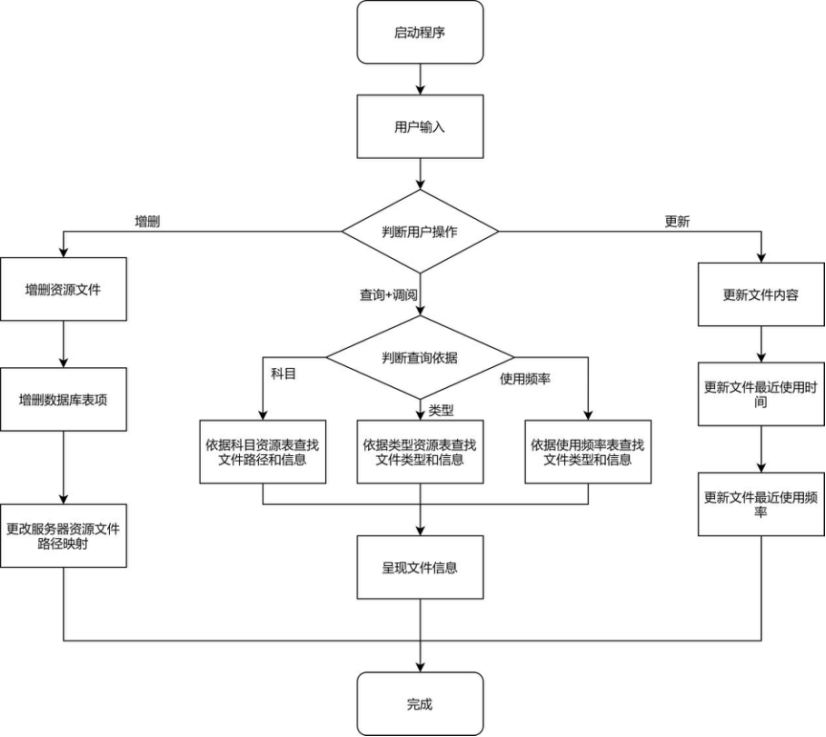 

## 2.2 数据字典

1、用户信息User表

| 字段含义 | 字段名称 | 类型        | 约束        |
| -------- | -------- | ----------- | ----------- |
| 用户名   | user_id  | varchar(30) | primary key |
| 密码     | password | varchar(30) | not null    |
| 昵称     | nickname | varchar(30) |             |

 

2、用户设备信息表Device

| 字段含义       | 字段名称        | 类型         | 约束                     |
| -------------- | --------------- | ------------ | ------------------------ |
| 用户名         | user_id         | varchar(30)  | not null                 |
| 设备编号       | dev_id          | varchar(30)  | not null                 |
| 设备名称       | dev_name        | varchar(30)  | not null                 |
| 设备路径       | dev_path        | varchar(256) | primary key\|foreign key |
| 资源总数       | resource_number | varchar(256) | not null                 |
| 资源总空间数   | resource_space  | integer      |                          |
| 设备最大空间数 | dev_space       | integer      |                          |

 

3、设备资源信息表DeviceResource

| 字段含义 | 字段名称      | 类型         | 约束                     |
| -------- | ------------- | ------------ | ------------------------ |
| 资源路径 | resource_path | varchar(256) | primary key\|foreign key |
| 设备路径 | device_path   | varchar(256) | primary key\|foreign key |
| 资源名称 | resource_id   | varchar(30)  | not null                 |

 

4、资源基本信息表 Resource

| 字段含义 | 字段名称       | 类型         | 约束                     |
| -------- | -------------- | ------------ | ------------------------ |
| 设备路径 | dev_path       | varchar(256) | primary key\|foreign key |
| 资源路径 | resource_path  | varchar(256) | primary key\|foreign key |
| 资源类型 | resource_type  | varchar(30)  | not null\|foreign key    |
| 资源大小 | resource_space | integer      |                          |
| 资源名称 | resource_id    | varchar(30)  | not null                 |

 

5、科目资源信息表ClassResource

| 字段含义 | 字段名称      | 类型         | 约束                     |
| -------- | ------------- | ------------ | ------------------------ |
| 设备路径 | dev_path      | varchar(256) | primary key\|foreign key |
| 资源路径 | resource_path | varchar(256) | primary key\|foreign key |
| 用户名   | user_id       | varchar(30)  | foreign key\|not null    |
| 学科名称 | class_id      | varchar(30)  | not null                 |
| 资源名称 | resource_id   | varchar(30)  | not null                 |

 

6、文档资源信息表DocResource

| 字段含义 | 字段名称      | 类型         | 约束                     |
| -------- | ------------- | ------------ | ------------------------ |
| 用户id   | user_id       | varchar(256) | foreign key              |
| 资源路径 | resource_path | varchar(256) | primary key\|foreign key |
| 资源名称 | resource_id   | varchar(30)  | not null                 |
| 设备路径 | dev_path      | varchar(256) | primary key\|foreign key |

 

7、音频/视频资源信息表MediaResource

| 字段含义 | 字段名称      | 类型         | 约束                     |
| -------- | ------------- | ------------ | ------------------------ |
| 用户id   | user_id       | varchar(256) | foreign key              |
| 资源路径 | resource_path | varchar(256) | primary key\|foreign key |
| 资源名称 | resource_id   | varchar(30)  | not null                 |
| 设备路径 | dev_path      | varchar(256) | primary key\|foreign key |

 

8、最近使用文件RecentResource

| 字段含义         | 字段名称        | 类型         | 约束                     |
| ---------------- | --------------- | ------------ | ------------------------ |
| 用户id           | user_id         | varchar(256) | foreign key              |
| 资源名称         | resource_id     | varchar(30)  | not null                 |
| 设备路径         | dev_path        | varchar(256) | primary key\|foreign key |
| 资源路径         | resource_path   | varchar(256) | primary key\|foreign key |
| 资源最近使用时间 | recent_use_time | Timestamp    | not null                 |

 

9、常用文件FrequentUseResource

| 字段含义       | 字段名称      | 类型         | 约束                     |
| -------------- | ------------- | ------------ | ------------------------ |
| 用户id         | user_id       | varchar(256) | foreign key              |
| 资源名称       | resource_id   | varchar(30)  | not null                 |
| 设备路径       | dev_path      | varchar(256) | primary key\|foreign key |
| 资源路径       | resource_path | varchar(256) | primary key\|foreign key |
| 近一周使用频率 | frequency     | double       | not null                 |

 

10、云端空间管理表CloudManagement

| 字段含义 | 字段名称    | 类型         | 约束        |
| -------- | ----------- | ------------ | ----------- |
| 空间编号 | cloud_id    | varchar(30)  | primary key |
| 设备数目 | dev_path    | varchar(256) | not null    |
| 用户数目 | user_number | integer      | not null    |
| 用户id   | user_id     | varchar(256) | foreign key |

 

# 3 可行性分析

## 3.1 技术可行性

随着5G时代的到来与云服务技术的发展，网络传输速度不断提高，算力资源不断由本地提交到远端。现有的文件管理系统如WPS，已经融合了WPS云文档等技术，即存即传，以防止因为本地设备原因丢失数据。当前的云传输速度和传输技术足以满足该系统的实现功能。

## 3.2 应用可行性

现有的文件管理系统难以同步跨设备、跨软件应用的文件。以WPS为例，WPS能够方便管理手机端和电脑端的文档文件，囊括word、pdf、ppt、excel等基本办公资源，能够对于该类资源进行有效的存储管理。然而wps的功能仅仅局限于办公文件资源，对于其它类型的文件难以统一管理；与此同时，wps无法针对学习的内容（如学习科目、文件类别等）进行分类管理，往往打开之后只能够罗列所有最近打开的文件，难以做到智能管理的目的。

## 3.3 经济可行性

在忽略数据库构建成本的情况下，该系统的管理成本与云服务器的维护成本+网络传输成本接近，足以保证经济上的可行性。

# 4 概念设计

## 4.1 概述

对于整个概念设计，重点完成以下几个工作：

1、将需求分析中根据经验得到的数据字典拆分整合为实体与实体间的关系，要求尽可能保证关系中尽量不出现属性，实体中的属性尽量减少冗余。

2、将数据字典改为实体表时，要注重重新修改实体表与属性的命名以符合数据库的规范化表达。

3、分析表达实体以及实体之间关系的方法，以数据字典为参照，必要时可新增或删减字段以优化设计。

## 4.2 属性描述

### 4.2.1 用户信息表

实体说明

用户信息表用于载入已注册并且构建好资源映射的用户信息，用于调阅、增加、删除。用户信息由不可重复的用户名id唯一标识。

属性说明

| 属性   | 字段名   | 描述               |
| ------ | -------- | ------------------ |
| 用户名 | id       | 确定账户的唯一标识 |
| 密码   | password | 用户用于登陆的密码 |
| 昵称   | nickname | 用户自定义的名称   |

 

 

### 4.2.2 用户设备表Device

实体说明

用于记录用户当前使用哪些设备来存储数据、用户设备当前使用情况、资源分配情况，以及对应设备所在的云盘资源盘号。每个用户拥有多台设备(如PC、ipad等)

属性说明

| 字段含义     | 字段名称        | 描述                                   |
| ------------ | --------------- | -------------------------------------- |
| 用户名       | id              | 确定账户的唯一标识                     |
| 设备编号     | dev_id          | 确定该账户对应设备的编号               |
| 设备名称     | dev_name        | 每个设备拥有一个设备名称，用于用户区分 |
| 设备路径     | dev_path        | 确定云服务器对应设备映射地址的唯一表示 |
| 现有资源量   | occupied_space  | 该设备所拥有的资源占用的空间总量       |
| 设备空间容量 | dev_space       | 该设备最大物理空间                     |
| 资源总数     | resource_number | 该设备所拥有的资源的总数目             |
| 所在云盘号   | cloud_id        | 当前设备映射所在的云盘盘号（默认为1）  |

 

### 4.2.3 设备资源信息DeviceResource表

实体说明

用于记录每一个设备下拥有的资源信息，包括资源名称、路径信息；由于与本地物理存储记录的顺序相同，用于主索引的构建。

属性描述

| 字段含义 | 字段名称      | 描述                                   |
| -------- | ------------- | -------------------------------------- |
| 资源路径 | resource_path | 设备管理的资源文件的唯一标识，主键     |
| 资源名称 | resource_id   | 资源文件名                             |
| 设备路径 | dev_path      | 确定云服务器对应设备映射地址的唯一表示 |

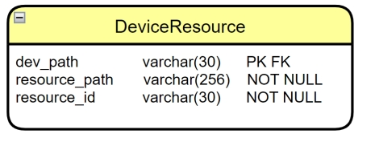 

### 4.2.4 基本资源信息表Resource

实体说明

Resource表用于记录每一个资源文件的详细信息，通过设备标号和资源路径作为唯一定位资源的标志，另外记录资源类型、大小、名称等该文件的基本信息。

属性描述

| 字段含义 | 字段名称       | 描述                               |
| -------- | -------------- | ---------------------------------- |
| 设备路径 | dev_path       | 云服务器对应设备映射地址的唯一表示 |
| 资源路径 | resource_path  | 每个设备对应资源的路径             |
| 资源id   | resource_id    | 资源文件名                         |
| 资源类型 | resource_type  | 资源文件格式，文档、音频/视频      |
| 资源大小 | resource_space | 资源占空间的大小，上传时自动确定   |
| 资源名称 | resource_id    | 资源文件名称，上传时自动确定       |

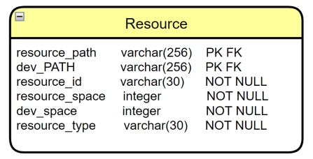 

### 4.2.5 科目资源信息表ClassResource

实体说明

科目资源信息表用于“分科目”，存储自定义科目存储的，达到根据科目索引访问所有的资源信息的目的。滤去基本信息，增添class_id字段用于存储分科目的记录信息。

属性描述

| 字段含义 | 字段名称      | 描述                               |
| -------- | ------------- | ---------------------------------- |
| 用户id   | user_id       | 唯一确定用户的编号                 |
| 科目名称 | class_id      | 用户自定义科目的名称               |
| 设备路径 | dev_path      | 云服务器对应设备映射地址的唯一表示 |
| 资源路径 | resource_path | 该用户设备所管理资源的唯一标识     |
| 资源名称 | resource_id   | 对应科目资源文件名                 |

 

 

### 4.2.6 文档资源信息表DocResource

实体说明

文档资源信息表用于记录用户所有的设备和目录下分类为“文档类”的资源信息，用于归类查找和索引。

属性描述

| 字段含义 | 字段名称      | 描述                               |
| -------- | ------------- | ---------------------------------- |
| 用户id   | user_id       | 唯一确定用户的编号                 |
| 资源路径 | resource_path | 该用户设备所管理资源的唯一标识     |
| 设备路径 | dev_path      | 云服务器对应设备映射地址的唯一表示 |
| 资源名称 | resource_id   | 文档类资源文件名                   |

 

 

### 4.2.7 音频/视频资源信息表MediaResource

实体说明

音频/视频资源信息表用于记录用户所有设备下分类为“音频/视频”类的资源信息，方便归类与索引。

属性描述内容与4.2.6文档资源信息表DocResource相似，在此不赘述。

### 4.2.8 最近使用文件RecentResource

实体说明

最近使用文件信息表用于记录用户最近使用的文件，方便用户再使用在线资源学习管理系统当中更好找到最近使用过的文件，作为学习资源管理系统的拓展功能。

属性描述

| 字段含义         | 字段名称        | 描述                               |
| ---------------- | --------------- | ---------------------------------- |
| 用户id           | user_id         | 唯一确定用户的编号                 |
| 资源id           | resource_id     | 唯一确定资源文件的编号             |
| 资源路径         | resource_path   | 该用户设备所管理资源的唯一标识     |
| 设备路径         | dev_path        | 云服务器对应设备映射地址的唯一表示 |
| 资源最近使用时间 | recent_use_time | 最近一次使用资源的时间             |

 

### 4.2.9 常用文件FrequentUseResource

实体说明

最近使用文件信息表用于记录用户最近一周内使用最为频繁的文件资源，用户更好定位近期内使用频率最高的资源方便用户的继续使用、提高定位效率，作为学习资源管理系统的拓展功能。

属性描述

| 字段含义       | 字段名称      | 描述                               |
| -------------- | ------------- | ---------------------------------- |
| 用户id         | user_id       | 唯一确定用户的编号                 |
| 资源路径       | resource_path | 该用户设备所管理资源的唯一标识     |
| 设备路径       | dev_path      | 云服务器对应设备映射地址的唯一表示 |
| 近一周使用频率 | frequency     | 音频/视频类资源所占空间总量        |
| 资源id         | resource_id   | 唯一确定资源文件的编号             |

 

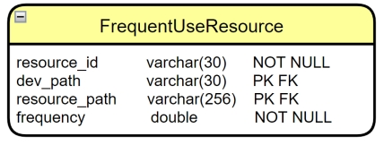 

### 4.2.10 云端空间管理表CloudManagement

实体说明

由于用于存储用户的云盘可能不止一个，该表记录了所有云盘的资源管理的所有设备情况、用户编号、数目，以及统计总共占有的空间容量、最大空间容量信息。

属性描述

| 字段含义       | 字段名称             | 描述                                  |
| -------------- | -------------------- | ------------------------------------- |
| 云盘编号       | cloud_id             | 默认为1，如果容量超出限制需要增加云盘 |
| 用户id         | user_id              | 唯一确定用户的编号                    |
| 已占有空间数目 | cloud_occupied_space | 已占有的空间数目                      |
| 最大空间容量   | cloud_max_space      | 云端拥有的最大空间容量                |

 

## 4.3 关系描述

在关系描述中，将从静态数据的关系出发，分析其中关系的复杂性，再提出以“记录”作为解决办法的“实体-关系-实体-关系-实体”的一种关系描述。给出各实体集间的局部关系。

### 4.3.1 用户-设备关系描述

用户与设备具有一个1对多的关系，具体描述为一个用户账号对应能够拥有多个物理设备，每个物理设备只能够由一个用户所拥有，每个用户对应的设备由设备编号所唯一确定。

 

### 4.3.2 用户-科目文件关系描述

用户与科目文件具有一对多关系，一个用户能够拥有多个科目的文件，而一个科目的文件只能够由一个用户所拥有；不同用户能够拥有不同科目类别的文件，具体“科目”名称由用户提交时自行决定。

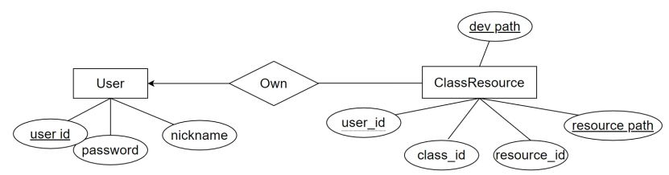 

### 4.3.3 用户-文档类/用户-媒体类文件关系描述

用户与文档类/媒体类文件具有一对多关系，一个用户能够拥有多个文档类/媒体类文件，而一个文档类/媒体类文件只能够由一个用户所拥有；不同用户能够拥有不同文档类/媒体类文件。

 

### 4.3.4 文档类/媒体类/科目文件资源与基本资源关系描述

每个文档类/媒体类/科目文件资源对应一种基本资源信息，每一个文件的基本信息可以不对应文档类/媒体类/科目文件资源中的任何一种。即每个基本资源信息可以不属于上述资源文件分类中的任何一类。

 

### 4.3.5 设备资源与基本资源信息关系描述

每个设备资源与基本资源具有一对一的对应关系，即每个设备资源只能对应一种基本资源信息，且每一种基本资源信息至少有一个设备资源与之相对应。

 

### 4.3.6 用户设备与设备管理云盘信息关系描述

用户设备和设备管理云盘是多对1的关系，一个用户设备由一个设备管理云盘进行管理，一个设备管理云盘只能够管理一个用户设备。

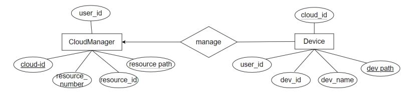 

 

## 4.4 全局E-R图

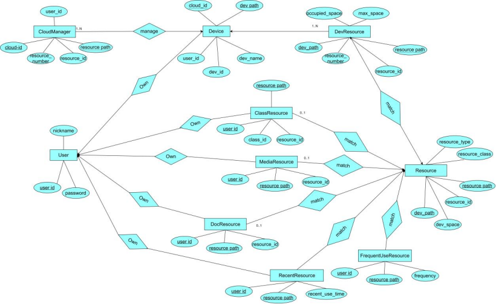 

## 4.5 全局UML设计图

 

# 5 逻辑设计

## 5.1 关系模型

在逻辑设计中，需要对概念设 计的 E-R 图转化为关系模式并对模型进行审视，具体将完成以下几个工作： 

1、根据 E-R 图中的数据表给出关系模式的属性集，依赖关系集

2、对额外添加的概念设计中的实体表主键进行审视，若多余可进行剔除

3、对概念设计时的关系表进行判断，如果仍是弱实体集则添加新的属性，如果已有的属性已能保证关系表的属性原子性（即不具有多值），则去除概念设计中添加的主码

4、完成上述处理后已确保为 1NF，接下来若各关系模型不满足 3NF，将其改写为 3NF 形式，并给出各关系模型的函数依赖5、对概念设计中表的结构的错误进行修改

6、事实上在概念设计时，已经尽可能保证表的结构尽量满足 3NF 要求，因此绝大多数表不需要进行改动。

### 5.1.1 关系模型的转换

#### 5.1.1.1 用户信息表

依赖关系、属性分析与描述

在确定user_id的情况下nickname、password被唯一确定，因此 user_id→nickname；user_id→password；对于上述三个属性的存在都是必须的，且无需添加多余的属性。CK为user_id；设计满足3NF，无需拆分。

关系模式

 

 

#### 5.1.1.2 用户设备表

依赖关系、属性分析与描述

由于设备编号（dev_path）整个云端的设备编号的唯一路径，其余所有与该设备相关的属性（dev_id, dev_name, dev_path, occupied_space, dev_space, resource_number, cloud_id)被唯一确定，因此 dev_path能够推导出其余所有属性。对于上述属性来说，其余属性都是能够表征当前设备相关信息，但不能唯一表征当前设备的功能。因此CK仅为dev_path，设计满足3NF，无需拆分。

关系模式

 

 

 

 

 

#### 5.1.1.3 设备资源信息表

依赖关系、属性分析与描述

在确定设备路径dev_path、文件资源路径resource_path的情况下，资源文件名resource_id被唯一确定，因此有(dev_path, resource_path)  resource_id；

对于上述三个属性的存在都是必须的，且无需添加多余的属性。CK为dev_path, resource_path；设计满足3NF，无需拆分。

关系模式

 

 

#### 5.1.1.4 基本资源信息表

依赖关系、属性分析与描述

在确定设备路径dev_path、文件资源路径resource_path的情况下，资源文件名resource_id被唯一确定，进而有设备文件大小，类型等信息被唯一确定。因此有(dev_path, resource_path)  resource_id，(dev_path, resource_path)  resource_type, (dev_path, resource_path)  resource_space；

对于上述所有属性当中 resource_id的存在并不是必须的，因为在resource的上层模式（设备管理文件、文档/媒体类资源文件）当中resource_id都能够被直接确定，此处无需再添加resource_id属性，故将其去除。

去除后的关系模式中，CK为dev_path, resource_path；设计满足3NF，无需拆分。

关系模式

 

 

 

#### 5.1.1.5 科目资源信息表

依赖关系、属性分析与描述

与基本资源信息表模式的分析相同，dev_path，resource_path能够唯一确定出文件相关信息如资源文件名resource_id、对应科目分类class_id；同是由于资源文件与用户是多对一的关系，一个科目资源文件只能够确定一个所属的用户，因此用户id也被唯一确定。

对于上述所有属性在用户进行检索的过程当中都是非冗余的，在该表当中并没有存储与资源文件本身有关的信息，具体的资源文件本身的信息存储在基本资源信息表当中。CK为dev_path, resource_path；设计满足3NF，无需拆分。

关系模式

 

 

#### 5.1.1.6 文档资源信息表DocResource

依赖关系、属性分析与描述

与上述分析类似，dev_path，resource_path能够唯一确定出资源文件名resource_id，同是由于资源文件与用户是多对一的关系，一个科目资源文件只能够确定一个所属的用户，因此用户id也被唯一确定。

CK为dev_path, resource_path；设计满足3NF，无需拆分。

关系模式

 

 

#### 5.1.1.7 音频/视频资源信息表MediaResource

与文档资源信息表分析一致，CK为dev_path, resource_path；设计满足3NF，无需拆分。

关系模式

 

 

 

#### 5.1.1.8 最近使用文件RecentResource

依赖关系、属性分析与描述

与基本资源信息表模式分析相似，dev_path，resource_path能够唯一确定出资源文件名resource_id；同是由于资源文件与用户是多对一的关系，一个科目资源文件只能够确定一个所属的用户，因此用户id也被唯一确定。除此之外，加入资源最近使用时间字段recent_use_time字段，作为最近更改的文件的筛选条件。

对于上述所有属性在用户进行检索的过程当中都是非冗余的。CK为dev_path, resource_path；设计满足3NF，无需拆分。

关系模式

 

 

#### 5.1.1.9 常用文件表

依赖关系、属性分析与描述

与最近使用文件RecentResource分析基本一致。将字段改为资源最近7日内使用频率frequency字段，作为筛选条件即可。

CK为dev_path, resource_path；设计满足3NF，无需拆分。

关系模式

 

 

#### 5.1.1.10 云端空间管理表CloudManagement

依赖关系、属性分析与描述

云端资源盘号有cloud_id字段唯一确定，对应云盘相关信息如cloud_occupied_space、cloud_max_space等均由此直接确定。

由于一个盘块号能够允许多个用户共同使用，因此cloud_id无法唯一确定user_id，不满足3NF范式要求，同时该属性也是冗余属性，在此将其去除。

去除后的关系模式CK为cloud_id；设计满足3NF，无需拆分。

关系模式

 

 

## 5.2 表结构设计

由于篇幅限制，在此仅列举因3NF分解和冗余属性调整后，需要更新的表结构，其余未更新的参考数据字典和实体定义中的表结构描述。

更新1——资源基本信息表 Resource，去除冗余字段：资源名称（resource_id）

| 字段含义 | 字段名称       | 类型         | 约束                     |
| -------- | -------------- | ------------ | ------------------------ |
| 设备路径 | dev_path       | varchar(256) | primary key\|foreign key |
| 资源路径 | resource_path  | varchar(256) | primary key\|foreign key |
| 资源类型 | resource_type  | varchar(30)  | not null                 |
| 资源大小 | resource_space | integer      |                          |

更新2——云端空间管理表CloudManagement，3NF限制删除用户名user_id

| 字段含义       | 字段名称             | 类型        | 约束        |
| -------------- | -------------------- | ----------- | ----------- |
| 空间编号       | cloud_id             | varchar(30) | primary key |
| 已占有空间数目 | cloud_occupied_space | integer     |             |
| 最大空间容量   | cloud_max_space      | integer     |             |

# 6 物理设计

## 6.1 概述

在逻辑设计中，已对项目的后台存储部分进行了规范化的数据库设计。在逻辑设计的基础上，需要根据项目的功能，确定数据库中某些字段由于功能而需要的约束。同时，在实现前端功能与后端数据库的交互时，有一些数据会经常被访问，因此需要在这些数据建立索引。

对于学习资源文件管理系统而言，资源文件的索引方式尤为重要，以优秀的方式进行索引能够极大提升用户对于存储资源文件检索的效率。与此同时，针对用户对用户所拥有的文件按照“不同的方式”进行索引时可能会有较大的时间差异，此时需要采取一种较优的索引建立进行权衡。

由于用户信息和资源信息较为独立，用户登录后的目的为资源索引的查找，我们将需要索引的对象划分为“用户信息索引”、“资源信息索引”两大类。

### 6.1.1 用户信息索引建立

根据功能需求，用户信息索引当中保存了当前用户的基本信息，对应用户所拥有的设备信息和对应文件信息等。

由于在设置用户帐号时不允许重复，因此对帐号的索引可以选择唯一性索引。根据约束，账号的长度是有限制的，因此不必使用前缀。综上考虑，可以使用按字符排序的方式建立唯一性索引进行查找。

### 6.1.2 资源信息索引

依据功能需求的更新机制，系统将会自动保存用户在本地提交的所拥有更新并记录时间，一切用户的学习资源由用户本人提交。因此在该系统中，对于所有的资源信息索引都在静态的机制中完成，不存在动态更新的信息（如果后续需求能够实现用户保存本地文件后自动提交更新到云端，可以在此基础上添加该功能）。

#### 6.1.2.1 按设备资源信息建立主索引

1、由于系统中基本资源信息为所有用户所有设备下设备资源信息的映射关系，设备资源与基本资源信息为一对一关系，其他索引方式（如根据文件类别、所属科目等方式）建立索引都不具备一对一的关系；

2、文件的增删操作都只能通过设备资源文件信息模式进行添加和修改。通过该种方式建立主索引具有最为广泛的搜索应用价值。

基于上述两点原因，考虑按照设备资源信息建立主索引，将每个用户不同设备信息存储在磁盘连续的单元块当中，能够最快最有效的实现索引。

#### 6.1.2.2 按资源类别、所属科目、使用时间等信息建立辅助索引

资源类别、所属科目采用静态hash建立辅助索引

由于资源类别、所属科目等信息所包括的资源数目多、类别较少，符合静态hash的优势，考虑采用类别、科目名称的字符串的大小设计hash索引，依据索引值返回查询到对应的bucket，每个bucket当中以以设备文件名为主索引，通过指针的方式连接到对应的物理存储结构中。

最近使用时间、使用频率信息采用B+树方建立辅助索引

由于每个文件记录不同的使用时间和频率信息，都为浮点数类型的变量，采用静态hash的方式很难对于该种较为连续的时间进行索引的建立。而B+树具有较优的范围查找的能力，通过对于每一个节点依据使用时间或者频率值的大小进行比较，构建B+树索引，通过查询结果范围的磁盘指针精准定位到磁盘的文件位置，即可完成查询定位操作。

# 7 应用系统实现与功能调试

## 7.1 软件实现总体框架

软件总体框架如下图所示：

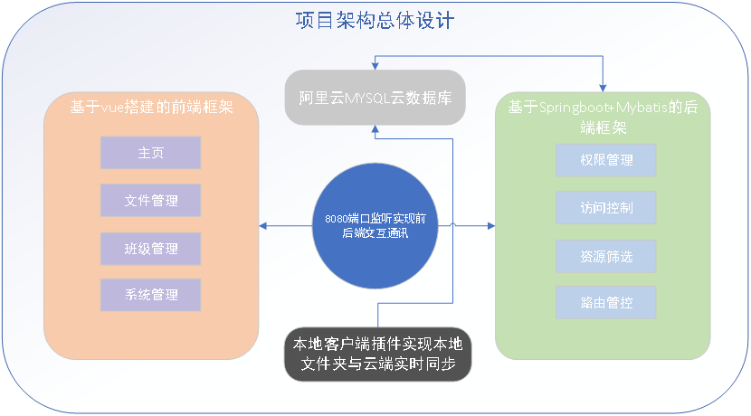

由上图可知，软件总体分为4个部分：

1、基于阿里云的mysql云数据库建立；

2、基于vue搭建的前端框架；

3、基于Springboot+Mybatis搭建的后端框架；

4、本地客户端插件实现本地文件夹与云端的实时同步实现；

其中mysql数据库与后端接口进行相互调用来进行资源信息、用户信息的及时存储与调用；而客户端插件则用于实时监听本地的文件是否发生移动、增加、删除和修改，用于实时完成本地文件与云端文件的同步功能。

基于Springboot+Mybatis框架搭建的后端通过设计好的Controller层针对于8080端口传来的所有的请求和相应信息进行处理交互，主要包括权限管理、访问控制、资源筛选、路由管控等功能，将生成好的数据交给前端进行处理。

基于vue+elementUI搭建的前端框架设计主页、文件管理、班级管理、系统管理等功能实现，展示，同时需要和后端相结合实现登录认证功能，包括登陆了验证、token生成与发放，超期时间自动断开连接等等功能。

## 7.2 数据库建立

数据库建立部分——基于mysql的数据库建立。我们采用DBeaver开源库进行数据库和数据表的构建。并最终部署在阿里云服务器上。

### 7.2.1 基于DBeaver的数据表构建

#### 7.2.1.1 Device数据表

该表格用于记录每一个资源所存储磁盘位置的信息

 

#### 7.2.1.2 Resource数据表

用于记录每一个资源本身的详细信息，把偶空资源路径，资源所属的用户等锡尼希

 

#### 7.2.1.3 Faculty数据表

用于记录每一个系下学院的学生/老师/负责人的关系信息

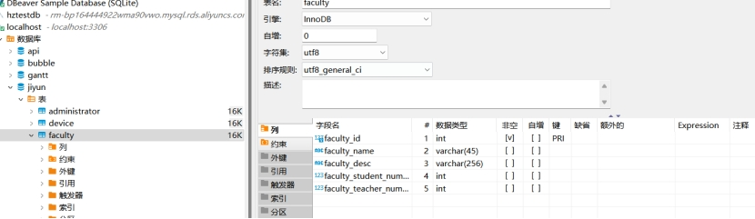 

 

#### 7.2.1.4 Sys_User表

用于记录每一个用户的基本信息，包括用户名、昵称、用户类型、电子邮箱、手机号码等等。

 

#### 7.2.1.5 User_Role表

用于记录每一个用户与对应角色之间的关系。角色包括超级管理员、教师管理员、普通用户（学生）对应的id。通过该表格构建用户本身与对应角色之间的关联关系。

 

#### 7.2.1.6 Role表

该表用于记录每一个角色对应的权限，信息和名称、关键字等信息用来保存角色相关的详细信息。

 

#### 7.2.1.7 Notice表

用于记录教师发布的相关公告信息，对应不同的权限的用户对于公告具有不同的权限，学生只具有查看公告的权力，教师具有查看、添加公告的权力而不能删除和修改已经发出的公告；超级管理员用户则具有查看、添加、修改、删除公告的所有权利。

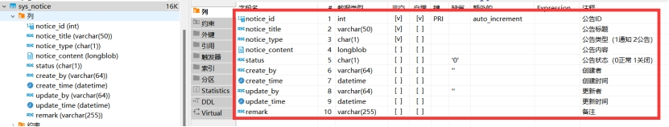 

#### 7.2.1.8 Menu表

用于记录不同的权限的用户所具有的所有功能，包括系统管理、系统监控、资源管理等功能。不同用户权限和功能各不相同。比如系统管理员能够进行系统管理和监控，而普通的用户只能进行资源的本身管理。

 

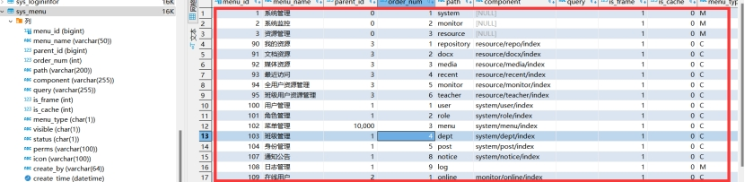 

#### 7.2.1.9 RoleMenu表

该表用来保存每一个角色对应的权限信息。这里主要指的是菜单访问控制相关的权限。比如管理员可以对于任意的资源进行曾删改查，可以对于任意的公告进行修改和删除，但这些功能对于学生来说是不可以的。

####  

#### 7.2.1.10 Login info

用于记录登陆时间和登录情况的日志，通过该日志可以判断用户是否在正常的时间进行登录。从而进行在线管控的功能。

 

### 7.2.2 基于JavaEntity的实体类构建

在通过对mysql数据库进行了基本的构建之后，我们需要建立数据库与后端之间的映射关系，而该应选择取决于java后端对应的数据表的构建。我们在核心区域构建java实体类。

在这里，我们将主要的资源管理模块，通过resource_repo实体类进行实现，该实体的管理的所有的资源文件，在云端和在本地的存储的相应映射关系。

 

其他的如Dept实体类则保存了所有的用户在不同的班级之间的对应关系。

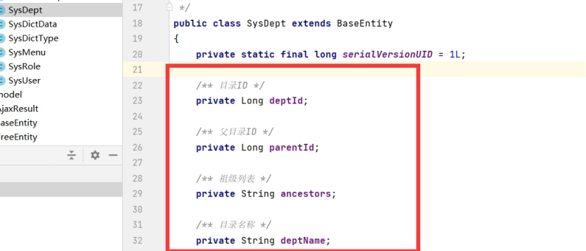 

Sys_Menu则保存了所有用户对应不同的权限所能看到的文件管理结构之间的差异性。Sys_Menu保存了所有的角色对应的不同权限需求。

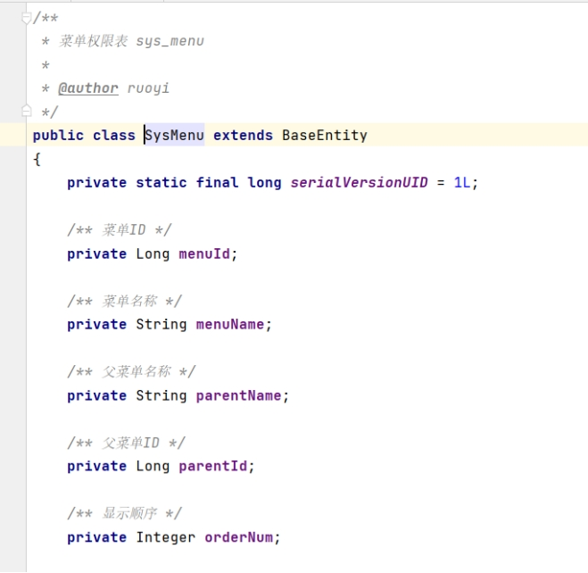 

Sys_User保存了所有的数用户相关的信息包括用户注册登录以及对应的所有信息。

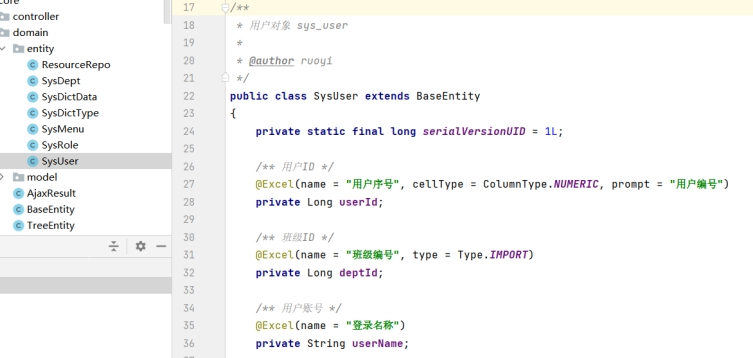 

### 7.2.3 基于Mybatis的Java实体类与数据库之间的映射关系

仅仅有数据库的数据以及后端的实体类是不足以实现整个数据处理的，我们需要将二者进行结合。我们通过mybatis技术来实现java后端与数据库之间的映射，该方法主要基于xml来进行SQL语言的书写，从而实现基于java后端调用SQL数据库，从而实现数据的筛选，整合一体管理功能。

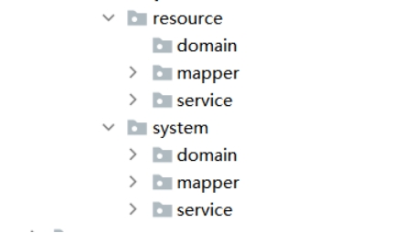 

整个管理机制，其余两个不同的板块第一个是resource板块，主要负责资源和目录部分的存储和管理；

 

第二个板块为system板块。该板块主要对于用户本身的权限进行管理。

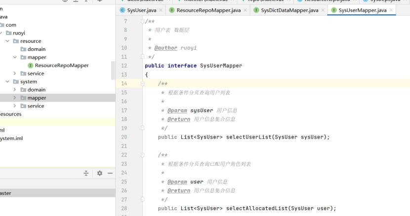 

这两个板块板块包括domain，mapper，service三个不同的子模块。每一个子模块包括不同的功能，例如domain用于进行数据表的构建工作；mapper负责进行数据表与服务之间的映射工作。service则负责将所有的数据处理之后的接口封装到该部分供controller模块进行调用。

## 7.3 后端实现

在所有对应的数据处理，接口都已经设计完成之后，我们需要将对应的接口打包封装为供给给前端的进行路由访问，后端需要基于controller提供服务，对于前端进行数据传输以及接口的交互。

对于controller，我们主要基于以下四个方面来进行设计：

#### 7.3.0.1 common模块

common模块主要包括了基本的前后端交互进行的访问接口。

#### 7.3.0.2 monitor模块

monitor，对于系统本身的状态系统成员登录的详细信息时间是否在线等信息进行交互来达到监管功能，这里以访问日志与登录信息为例展示接口对应的详细代码：

#### 7.3.0.3 resource模块

resource，包括对于用户本身的资源数据进行前后端交互系统。此处为整个软件进行前后端资源管理数据交互的核心接口。包括用户资源的权限限制，根据各种方式进行筛选、资源的增删改查等操作。

#### 7.3.0.4 system模块

system，对于用户本身的权限信息是否能够对用户本身进行增删改查等操作进行权限限定。

## 7.4 前端实现

### 7.4.1 技术选取

前端基于vue框架结合elementUI进行实现。

Vue是一套用于构建用户界面的渐进式框架。与其它大型框架不同的是，Vue 被设计为可以自底向上逐层应用。Vue 的核心库只关注视图层，不仅易于上手，还便于与第三方库或既有项目整合。另一方面，当与现代化的工具链以及各种支持类库结合使用时，Vue 也完全能够为复杂的单页应用提供驱动。

ElementUI是一套基于VUE2.0的桌面端组件库，ElementUI提供了丰富的组件帮助开发人员快速构建功能强大、风格统一的页面。

### 7.4.2 代码实现

使用vue进行前端框架的搭建的好处除了前后端分离之外，更为强大的是基于vue的前端框架的实现能够将整个项目所需要用到的各种接口通过封装成“调用库”的方式来封装，实现联络基层和界面展示层级相分离效果

#### 7.4.2.1 逻辑层实现

逻辑层用于封装前后端交互以及前端本身调用后端数据的接口

 

与后端对应的接口类似，此处主要包括monitor、resource、system以及tool四个类别。同时该四个类别也对应着前端展示的详细界面信息。除了tools之外，其他端口均能与界面相结合在前端进行展示。

#### 7.4.2.2 展示层实现

和逻辑部分对应的四点：monitor、resource、system，tools均在展示层部分进行实现。同时不同的功能呗封装为不同的组件由elementUI决定具体的存放和展示位置信息。

 

### 7.4.3 界面展示

#### 7.4.3.1 登录界面

登录界面主要包括基本的背景，通过输入用户名和密码信息。将对应的密码所存储的jwt加密存储值与数据库当中进行比较，同时需要进行验证码的验证。如果相同则进行token发放，该token标识了用户进行前后端交互的唯一依据。

如果验证码、密码、用户名任意一方发生错误则会进行警告。

 

#### 7.4.3.2 用户管理

 

#### 7.4.3.3 角色管理

 

#### 7.4.3.4 班级管理

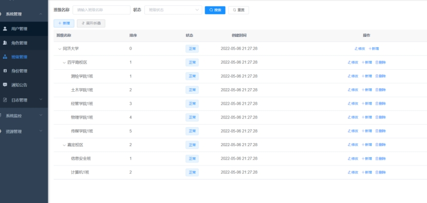 

#### 7.4.3.5 身份权限管理

 

#### 7.4.3.6 通知公告

 

#### 7.4.3.7 用户监控

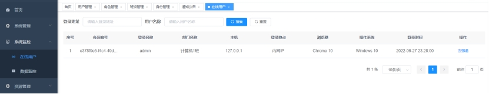 

#### 7.4.3.8 个人资源管理

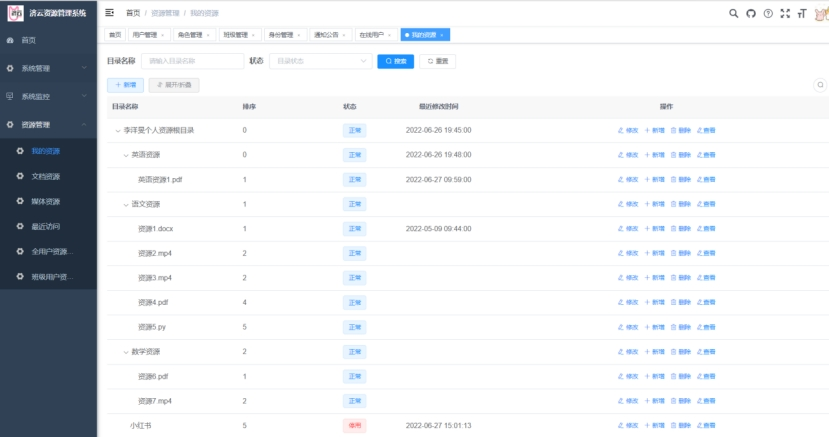 

#### 7.4.3.9 资源增删改查

 

#### 7.4.3.10 文档类资源管理

 

#### 7.4.3.11 媒体类资源管理

 

#### 7.4.3.12 最近访问资源

 

#### 7.4.3.13 全用户资源管理（超级管理员）

 

#### 7.4.3.14 班级用户资源管理（超级管理员+教师管理员）

 

# 8 系统综合测试与改进

## 8.1 功能测试

在功能测试部分，我们主要通过针对客户不同的用户账号，对于登录验证，资源管理，系统管理以及系统监控部分进行功能验证。来查看在不同的权限下其功能是否完整。

### 8.1.1 登录验证功能

我们采用正常登录的方式此处进行登录，可以发现当我们正常进行输入验证码的时候，我们就能够进行正常的跳转了。

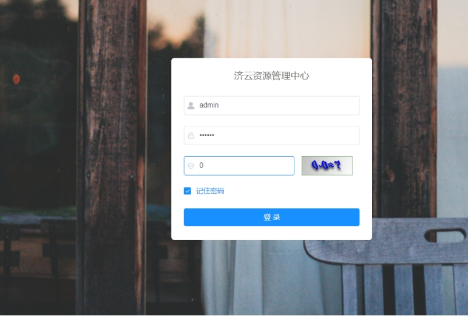 

那如果说当我们输入错误的验证码，系统则会弹出警告，告诉我们验证码不正确。让我们重新输入账号密码来进行登录。与此同时，此时的验证码片也将会实时更新来保证所有的验证码只能进行一次的验证。

 

我们可以发现对应的密码在数据库当中，也不会以明文的方式进行存放。因为以明文的方式进行存放会非常的不安全，此处我们采用md 5加密结果来进行存放，将最终的结果与用户的输入进行验证。来校验密码是否正确。

 

### 8.1.2 资源管理功能

#### 8.1.2.1 普通用户

 

资源管理来说，普通的用户仅仅有四种资源选择的方式。但是对于超级用户和教室管理员来说期权限就不一样了。对于教师管理员来说，在资源管理大板块下还具有能够访问班级同学资源的权利。对于超级管理员来说则更是具有能够管理全校同学资源的权利。

首先让我们来看一下我的资源本身。可以发现，当我们点击我的资源之后，对应呈现出来了与本地共享资源文件夹。完全一致的文件夹系统。

 

 

通过Python客户端脚本的方式，我们可以实时监控本地文件夹的变化情况。并将本地文件夹的变化实时同步到基于阿里云部署的MySQL数据库。

 

在这里我们可以手动的在网页端对于资源进行修改、新增、删除和查看。

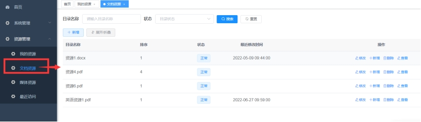 

通过点击文档功能，能够帮我们自动的从我的资源总目录当中筛选出。云端属于我本人的文档类型的。资源包括docx文件，pdf文件以及txt文件等。

同样当我们点击媒体资源时，它能够对于我我的文件当中的所有媒体资源进行筛查。

 

与此同时，我们还设计了最近访问功能，它能够将最近修改日期，五天之内的所有文件放在该目录下进行呈现。

 

#### 8.1.2.2 教师管理员（老师）

我们现在将账号切换成一个教师管理员的较好。来看一看资源管理的功能有哪些区别：

 

可以看到我们现在模拟李文跟老师的状态来进行登录。

我们可以发现在李文跟老师的账号下。我们可以调阅到计算机一班所有同学的资料。但是只能对于该资料进行新增，修改和查阅。而无法进行删除。所有对应的操作都将会被记录到服务器后台用于存储和备份记录。

可以看到我们现在只能够对于班级用户的资源进行修改和新增但是无法进行删除。

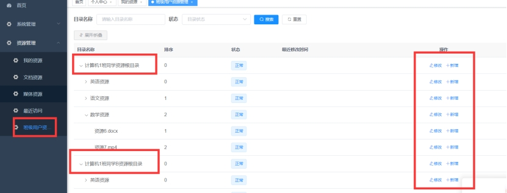 

#### 8.1.2.3 超级管理员

这时我们切换到超级管理员界面。

 

我们打开资源管理选项卡可以发现这里除了基本的资源管理的选项之外，还多了一个全用户资源管理的选项。这个选项当中我们可以查看到全校所有班级所有同学的对应资源情况以及的持的磁盘位置。

 

与此同时，我们也可以对他们传的所有的文件进行修改。增加和删除操作。即使是超级管理员，所有的操作日志也会被记录到。数据库当中用于查证。

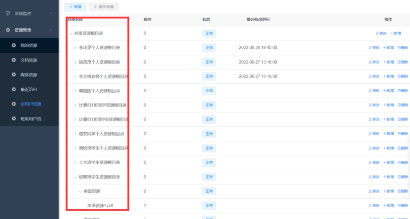 

### 8.1.3 系统监控功能（超级管理员）

我们为超级管理员开放了系统监控功能。系统监控功能能够将在线用户以及数据监控功能进行展示。在线用户板块能够监控到现在登录到网页当中的所有用户情况。而数据监控功能则能够通过管理员的身份登录到任意一个人的账号当中。进行监控和查看。

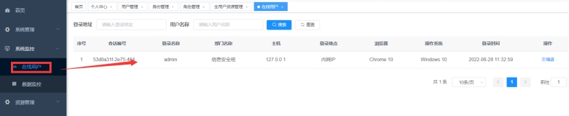 

 

特别注意该功能仅仅对于超级管理员开放，对于其他的成员并不会开放这个功能。

### 8.1.4 系统管理功能

系统管理功能主要包括用户管理，角色管理，班级管理。身份管理通知公告，日志管理6点，其中针对于不同的用户。具有的权限不一样，比如说超级管理员能够对于上述所有功能进行管理。而普通用户及学生只能对于通知公告进行查看。接下来我们将详细的进入每一个用户对其访问限制和功能限制进行详细的讲解。

#### 8.1.4.1 普通用户

首先对于普通用户来说，我们点开系统管理功能界面。旗下只有班级管理和通知公告两个板块的功能。我们能点开班级管：

 

可以发现对于普通用户仅仅具有观察整个班级管理权限的查看，但并不能够对其进行任何的操作。包括增加节点删除节点信息等权限。在通知公告部分，我们够观察到有超级管理员。及老师所发布的所有公告。但是同样无法对于发布的公告进行任何操作。包括编辑。删除等功能，只能进行查看。

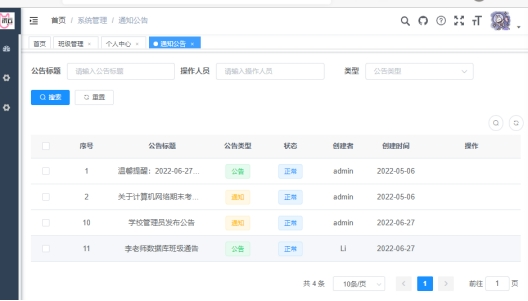 

#### 8.1.4.2 教师管理员（老师）

对于教师管理员来说，我们同样以李文根老师的账号进行举例。虽然仍然只有班级管理和通知公告两个功能，但是我们可以发现在这个环节下，我们可以对于单级相应的信息进行修改和新增。但无法进行删除。

 

对于通知公告来说，我们同样可以对于现有的公告进行新增和查看。但是无法进行修改和删除。方便老师对于学生进行通知公告的构建。但是不能对已经发布的公告进行修改。该功能只能有超级管理员来进行实现。

 

#### 8.1.4.3 超级管理员

现

最后我们换到超级管理员的账号。可以发现超级管理员具有用户管理，角色管理，班级管理，身份管理通知，公告以及日志管理的全部功能。

（1）用户管理

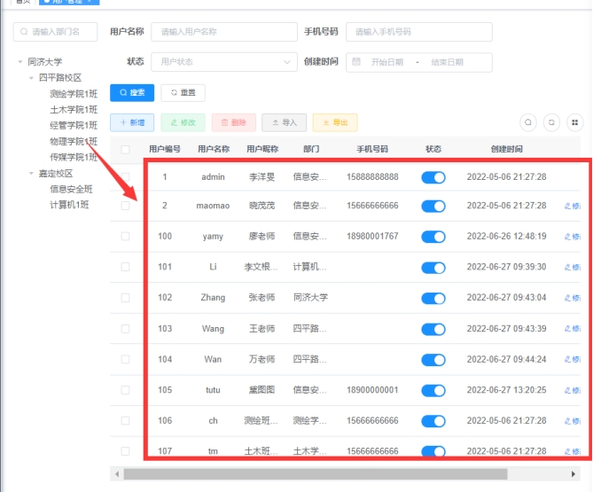 

我们可以发现用户管理的整个界面有两部分构成，左边为整个班级的构建数右边为所有的同学，老师教室管理员以及超级管理员等所有的用户信息。我们可以对于每一个用户信息进行修改，删除。

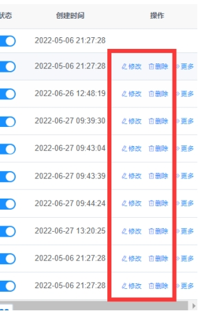 

操作同样也可以在这个界面当中新增其他的用户。与此同时，在这个界面当中我们还能够重置。现有用户的密码，为了防止用户忘记密码而进行的设置。我们同样也可以对于现有用户分配其所属的班级。

（2）角色管理

在角色管理的部分当中，我们能够对于现在已经提到的三种不同的角色超级管理员用户，教师，管理员用户以及普通用户及学生。进行对应权限的操作。同时我们也可以新增其他的。角色并对其进行权限控制。

 

（3）班级管理与教师，管理员相同。我们可以同样对于学校内所有的班级情况进行修改，新增和删除功能。

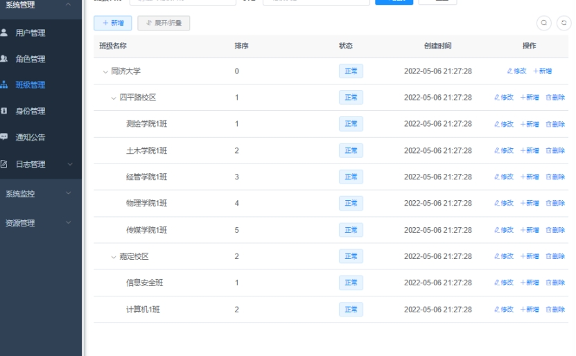 

（4）通知公告

这部分和教室管理员类似。能够对于现有的通知公告进行新增。同时还能够对于现有的通知公告进行修改和删除。

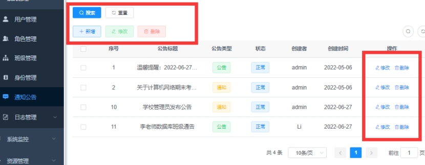 

（5）日志管理

在日志管理界面当中，我们可以查看到所有用户进行的操作日志以及登录日志。操作日志能够查看到所有用户对于权限内容和资源内容所进行的操作。

 

而登录位置怎么看到所有的用户进行登录的情况，包括登录状态，操作信息，（登录是否成功）以及他们登录的日期。

 

 

### 8.1.5 鲁棒性测试

#### 8.1.5.1 登录安全测试

首先验证验证，当我们输入错误的用户名和密码时候，系统会提示我们存在用户名不存在或密码错误的情况。

 

当我们输入一个错误的验证码时，系统会提示我们验证码输入错误。并且说的更新一个新的验证码。

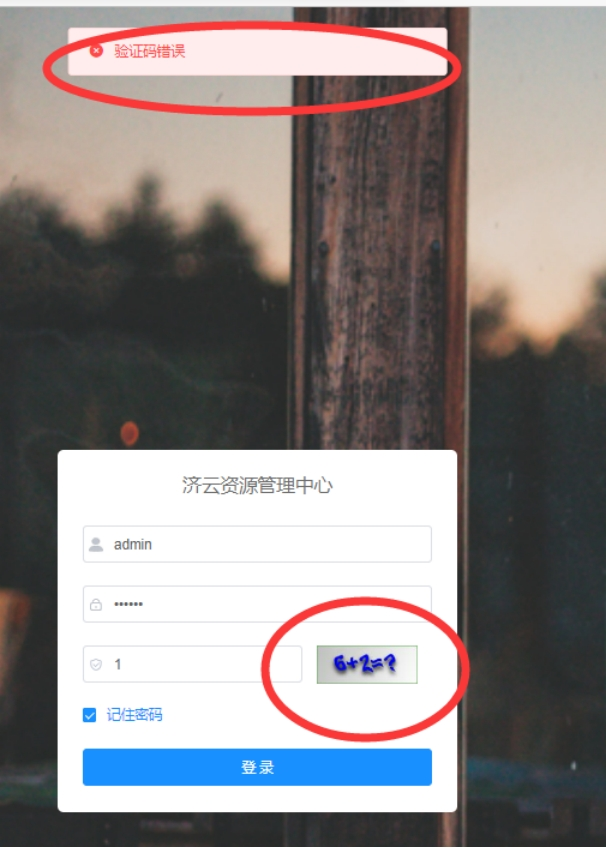 

#### 8.1.5.2 外键约束测试

这一个板块主要验证，对于数据库存储的数据如果我们不按照其正常的数据管理规范来进行增加和修改的时候数据的数据库时候，进行阻止操作、及时通知的功能。

首先由于外界约束限制，我们在创建一个新的表象的时候，我们必须要验证其所参照的主表当中是否有相关的字段，比如说我们这里来验证将一个权限赋予一个未在表象当中添加的用户的情况。

 

经过数据筛选，我们可以发现我们只能够对于教师管理员和学生来进行权限的分配。而不能对于未创建的角色编号来进行权限的分配。

由于外键约束，当目录资源或硬盘具有子资源的时候，不能将该表项进行删除，否则将破坏外界约束。我们尝试将李洋旻的个人资源目录进行删除。可以发现系统提示我们不能删除，因为下包含子目录和子资源。当其下不包含子目录和资源的时候，才满足外界约束条件，可以被删除。

 

 

# 9 总结与展望

## 9.1 系统总结

现有的管理平台如canvas能够很好的对于学生进行作业的提交教师及时登到canvas网站上面。能够对学生的文件文件进行查阅。根据很多同学的反应，往往存在邮箱提交失败、canvas由于网络传输原因提交失败或文件选择错误，导致老师看到的并不是最新版本的文件，或者有的时候由于网络原因直接都没能上交成功。导致最后发生较大的失误。

基于云服务器技术的发展，百度网盘，网易云游戏等等，能够统一多个设备、多种工具共同进行归纳管理的软件不断兴起。本文借鉴上述技术，由于云系统具有不占主机内存空间与进程等优点。一切操作无需在本地重复进行网站提交。在本地进行修改，其修改的内容即可及时同步到云端，由老师进行审查。

本文设计了一款基于云服务的班级学习资源在线管理系统。支持学生，教师和超级管理员的不同的用户进行管控。在资源管理方面，能够实现本地文件夹到云端文件夹的实时同步功能。并且根据不同用户的权限支持对于不同的资源信息进行查阅，修改，增加和删除等功能。

## 9.2 改进与完善

在系统设计上，系统实现了一个本地数据目录结构实时同步到云端数据库的功能。但是无法实现在网页端进行所有文件的查看和阅览功能。只能够支持下载。在之后的改进和完善过程当中，我们可以尝试将在网页实实现对于云同步的文件进行实时在线的网页端调阅。来减轻下载和查看的不方便。

在系统功能上，系统实现了一个资源管理的基本功能。但是老师在实际管理的过程当中，除了对于文件进行增删查改的功能之外，其实更多的还需要对于现有的资源进行评价来对于学生的总体作业表现。如果能够将该软件功能与分数系统结合起来，制造一个更加全面，应用更加广的系统，则能够具有更加广泛的应用价值。

在系统测试上，由于该系统的测试在本地进行，无法对于该系统进行压力测试。在之后的改进环节过程当中，我们可以尝试将该系统部署到云服务器。来实现实时在线的。登录和访问通过 Jmeter等测试工具来检验系统的负载支持能力。

# 参考文献

[1] Oracle数据库资源管理[EB/OL]. (2022-05-06)[2022-06-28]. https://cloud.tencent.com/developer/article/1993216.

[2] 数据库资源管理器(Database Resource Manager)[EB/OL]. (2012-10-29)[2022-06-28]. https://blog.csdn.net/cuichanla2083/article/details/100459906.

[3] 数据库课程设计 班级资源管理系统[EB/OL]. (2021-07-25)[2022-06-28]. https://blog.csdn.net/Us2jia/article/details/119087183.

[4] 数据库课程设计:图书信息管理系统(Java+MySQL)(附程序)[EB/OL]. (2021-07-14)[2022-06-28]. https://blog.csdn.net/weixin_44107140/article/details/118735793.

[5] 人力资源管理系统数据库设计_课程设计报告[EB/OL]. (2013-11-09)[2022-06-28]. https://www.docin.com/p-723282245.html.

[6] 创建和管理图书管理系统数据库[EB/OL]. (2022-01-13)[2022-06-28]. https://blog.csdn.net/weixin_45215308/article/details/122466749.

[7] 数据库实验系列之1数据库及数据库中表等数据库对象的建立实验(包括关系图、完整性、权限控制、视图、索引等内容)[EB/OL]. (2020-05-18)[2022-06-28]. https://www.cnblogs.com/wanggang9968/p/12908729.html.

[8] 功能测试之数据库测试[EB/OL]. (2019-04-25)[2022-06-28]. https://zhuanlan.zhihu.com/p/63716039.

[9] Spring Boot[EB/OL]. (2022-11-24)[2022-06-28]. https://spring.io/projects/spring-boot.

[10] MyBatis[EB/OL]. ()[2022-06-28]. https://mybatis.net.cn/.

[11] 数据库管理-DMS-数据库安全-开发者工具-阿里云[EB/OL]. (3540-03-05)[2022-06-28]. https://promotion.aliyun.com/ntms/act/dmsnewcustomerfirstbuy.

[12] 软件测试方法[EB/OL]. (2016-04-03)[2022-06-28]. https://blog.csdn.net/baidu_32739019/article/details/51052399.

[13] 瞿翠玲.高校院系资料室建设研究与实践[J].智库时代,2019(43):280-281.

[14] 李金鑫.高校图书馆资源利用与信息服务[J].边疆经济与文化,2011(10):158-159.

[15] 郑利荣.网络环境下的数据库开发和管理[J].医学信息,2021(09):585-586.